# End-to-End Control Across Abstraction Layers in a Mass–Spring–Damper System

*Author: Percival Segui*\
*Prepared as an independent engineering project record*.

*This document is a structured presentation of engineering artifacts, experiments, and observations recorded during a self-directed engineering effort and later organized for clarity and reference.*

---

## Project Context

This project is a self-directed embedded controls project exploring the discrete-time implementation of PID control on a second-order mass–spring–damper system.

The work developed incrementally through modeling, simulation, firmware implementation, and experimental observation. The project was used as a vehicle to deepen understanding of how classical control concepts translate into sampled-data systems and how embedded constraints-such as actuator limits, discrete-time update ordering, numerical effects, and measurement noise-shape closed-loop behavior in practice.

Rather than pursuing controller optimality, the emphasis throughout the project was on understanding behavior, validating assumptions, and maintaining a clear connection between physical modeling, simulation, and embedded execution.

---

## Technical Orientation

This project draws primarily on classical control theory as presented in standard texts (e.g., Nise; Ogata; Franklin, Powell, and Emami-Naeini). Continuous-time dynamics were developed first to establish physical grounding and intuition before being discretized explicitly for embedded execution.

Simulation and firmware were developed in parallel, with deliberate attention to feedback timing, saturation effects, anti-windup behavior, external disturbances, and measurement noise. Observed behavior was interpreted using basic control concepts (stability, damping, saturation, and integral correction) to separate feedback dynamics from implementation-specific effects.

---

## System Summary

The system consists of a simulated mass–spring–damper plant controlled via a discrete-time PID controller. The controller operates on sampled state information and generates a control signal intended to regulate the system’s position in response to a reference input.

Key elements include:

* A physics-based continuous-time plant model derived from Newtonian mechanics
* Discretization of the plant and controller for sampled-data control
* A PID controller structure implemented explicitly in difference-equation form
* Validation via MATLAB/Simulink prior to embedded deployment
* Embedded implementation with deterministic timing and logging support

---

## Project Outcome

The project produced a functioning discrete-time PID-controlled mass–spring–damper system with consistent behavior across simulation and embedded execution. The work provided concrete insight into the interaction between controller gains, actuator saturation, disturbance rejection, and measurement noise under realistic embedded constraints.

Equally important, the project established a repeatable workflow for modeling, simulation, and embedded verification that will serve as a foundation for more complex control systems in future projects.

---

## 1. System Architecture

The system is organized around a clear separation between the plant model, the controller, and the execution environment. This separation is maintained consistently across analysis, simulation, and embedded execution to make behavior traceable and to limit the number of variables that change at any one time.

The same logical partitioning between plant, controller, and execution environment is preserved across all representations of the system.

---
### 1.1 Mass Spring Damper Control System

At a high level, the system consists of a mass–spring–damper plant regulated by a discrete-time feedback controller. The controller computes a control input based on measured plant signals and a commanded reference. The control input is subject to practical constraints such as saturation and is applied at a fixed sampling rate.

#### 1.1.1 System Simulink Model

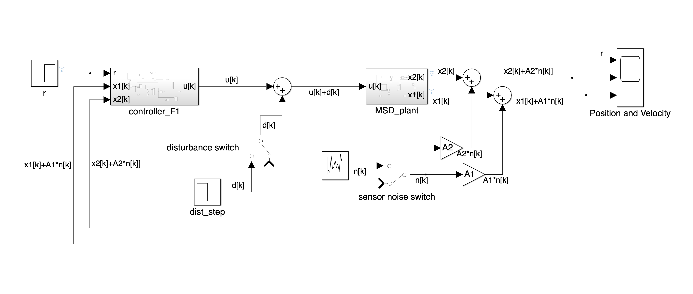

---

### 1.2 Plant

The plant is modeled as a second-order mechanical system with mass, stiffness, and damping. Position and velocity are used as the plant state variables. The control input is modeled as a force applied directly to the mass.

The plant model is intentionally minimal. It captures the dominant dynamics required to study tracking, damping, steady-state behavior, and the effects of disturbances, without introducing higher-order effects that would complicate interpretation. Nonlinearities are introduced only when they are the explicit subject of a test phase.

---
#### 1.2.1 Plant Simulink Model
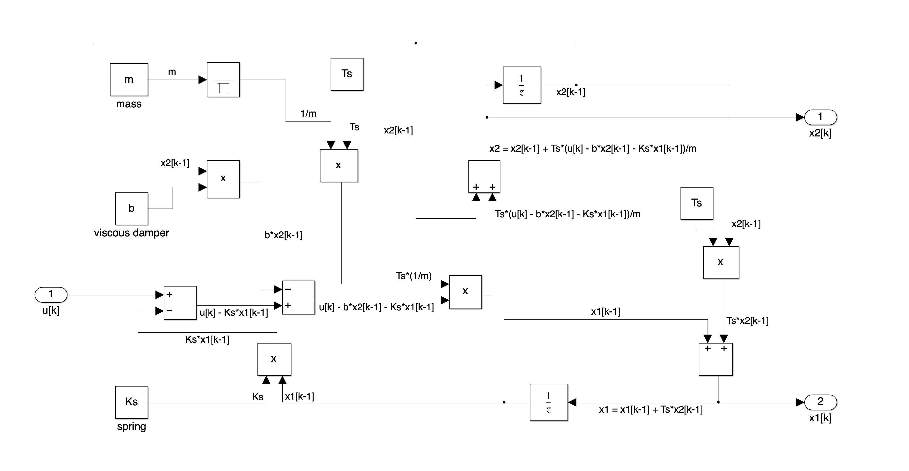

---

### 1.3 Controller

The controller is implemented as a discrete-time PID feedback controller. Each term of the controller is interpreted through its effect on the closed-loop dynamics to support clear cause-and-effect reasoning during design and implementation.

* Proportional action primarily shapes the transient response by scaling the instantaneous position error into control effort.
* Integral action compensates steady-state error caused by constant disturbances or bias.
* Derivative action improves damping by responding to velocity (since the reference is position).

All controller behavior is expressed explicitly in discrete time, with state updates occurring once per sample period.

For example, the integral term is implemented as a first-order difference equation of the form:

$$
I[k] = I[k-1] + T_s\ e[k]
$$

where $T_s$ is the sampling period and $e[k]$ is the position error at sample $k$. The controller output is computed from the current sample values and stored state, and the controller state is updated once per sample period.

Anti-windup is included to prevent integrator windup when actuator saturation is active.

The reference input represents a desired position command. Feedback consists of the plant signals used by the controller to compute control effort. Signal definitions, sign conventions, state ordering, and update timing are kept consistent across analysis, simulation, and embedded code.

---
#### 1.3.1 Controller Simulink Model
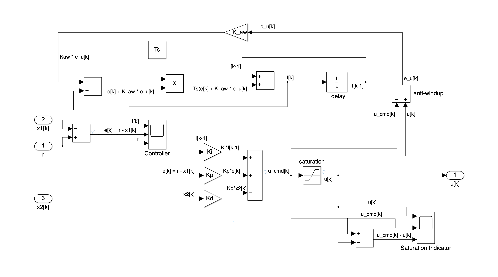

---

### 1.4 Execution Environment

The controller executes at a fixed sampling period. All control calculations, state updates, and logging occur synchronously with this time base.

The embedded environment is used to implement and check for consistency of numerical behavior, timing assumptions, and execution ordering. The plant itself remains simulated so that observed behavior can be attributed to the control logic and execution model rather than to mechanical variability.

This architecture allows simulation results and embedded controller execution results to be compared directly under equivalent conditions.

---

### 1.5 Architectural Intent

The intent of this architecture is not abstraction for its own sake, but to enable analysis and interpretation of system behavior. It exists to support:

* controlled introduction of non-idealities,
* direct comparison between domains,
* and clear attribution of observed behavior.

By keeping the structure stable and limiting changes to one aspect of the system at a time, the effects of modeling choices, discretization, and implementation details can be understood without ambiguity.

---

## 2. Plant Modeling - Mass–Spring–Damper System

The plant is modeled as a linear, second-order mass–spring–damper system derived directly from Newton’s second law. The model is intended to capture the dominant dynamics required for controller design, implementation, and verification.

In this context, *higher-order effects* refer to physical phenomena that introduce additional states, nonlinearities, delays, or secondary dynamics beyond those associated with inertia, stiffness, and damping. While such effects may be present in real physical systems, they are not required to study the closed-loop behaviors targeted in this work.

The plant model therefore includes only:

* inertial dynamics (mass $m$)
* linear restoring force (spring stiffness $K_s$)
* linear viscous damping ($b$)
* externally applied control force generated by the controller ($u[k]$)

These elements, together with system-level disturbance and noise modeling, are sufficient to evaluate transient response, damping behavior, steady-state error, disturbance rejection, actuator saturation, and anti-windup behavior.

An additive external disturbance force is applied at the plant input at the system level to evaluate disturbance rejection and steady-state behavior.

Measurement noise is applied to the plant output at the system level to evaluate noise sensitivity, derivative action effects, and robustness of the discrete-time controller.

Higher-order effects are intentionally excluded so that changes in system behavior can be attributed directly to known causes such as controller gain selection, saturation limits, disturbance magnitude, and measurement noise. This restriction preserves causal clarity and enables direct traceability between simulation results and embedded implementation.

The following higher-order effects are intentionally excluded:

**Mechanical nonlinearities**

* nonlinear spring behavior
* Coulomb friction, stiction, or hysteresis
* backlash or dead zones

**Additional physical states**

* flexible or higher-frequency structural modes
* distributed mass effects
* actuator internal electrical or drive dynamics (modeled instead as an ideal force source)

**Actuator and sensing non-idealities**

* actuator bandwidth limits or rate limits
* transport delay
* quantization effects
* sensor dynamics or filtering

Actuator and sensing non-idealities such as bandwidth limits, rate limits, transport delay, quantization, and sensor dynamics are excluded so that controller behavior can be evaluated without additional phase lag or secondary dynamics that would obscure cause-and-effect relationships.

**Sampling and execution artifacts**

* timing jitter
* variable sample period
* multi-rate or task-scheduling effects beyond explicit discretization

Multi-rate and task-scheduling effects, such as asynchronous execution, interrupt latency, and variable execution order, are excluded by assuming a single-rate, atomic control update executed once per sampling period.

---

### 2.1 Physical Description

The plant consists of:

* A mass $(m)$ constrained to move along a single axis
* A linear spring with stiffness $K_s$
* A viscous damper with damping coefficient $(b)$
* An externally applied control force $u(t)$

The system has two states:

* position
* velocity

The following operating assumptions are imposed:

* Spring behavior is linear (Hooke’s Law)
* Damping force is proportional to velocity
* No dry friction, backlash, or nonlinear stiffness terms are included

The control input is modeled as a force applied directly to the mass. External disturbances are modeled as additive forces.

---
### 2.2 Continuous-Time Model

The starting point is Newton’s second law applied to the mass:

$$
\sum F = m \ddot{x}(t)
$$

The forces acting on the mass are:

* spring force: $-K_s\ x(t)$
* damping force: $-b\ \dot{x}(t)$
* control input: $u(t)$

Summing these forces gives:

$$
m\ddot{x}(t) = u(t) - b\dot{x}(t) - K_sx(t)
$$

Rewriting this expression:

$$
m\ddot{x}(t) + b\dot{x}(t) + K_sx(t) = u(t)
$$

This is the second-order differential equation describing the mass-spring-damper plant dynamics.

---

#### 2.2.1 Solving for Acceleration

To prepare the equation for state-space representation, solve explicitly for $\ddot{x}(t)$.

Start from:

$$
m\ddot{x}(t) + b\dot{x}(t) + K_sx(t) = u(t)
$$

Subtract the damping and spring terms from both sides:

$$
m\ddot{x}(t) = u(t) - b\dot{x}(t) - K_sx(t)
$$

Divide both sides by (m):

$$
\ddot{x}(t) = \frac{1}{m}u(t) - \frac{b}{m}\dot{x}(t) - \frac{K_s}{m}x(t)
$$

Reorder terms:

$$
\ddot{x}(t) = -\frac{K_s}{m}x(t)-\frac{b}{m}\dot{x}(t)+ \frac{1}{m}u(t)
$$

---

#### 2.2.2 State Variable Definition

Define the state variables as:

$$
x_1(t) = x(t)
$$

$$
x_2(t) = \dot{x}(t)
$$

---

#### 2.2.3 State Derivative Equations

Differentiate the first state:

$$
\dot{x}_1(t) = \frac{d}{dt}x_1(t)
$$

Substitute the definition of $x_1(t)$:

$$
\dot{x}_1(t) = \frac{d}{dt}x(t)
$$

Since $x_2(t) = \dot{x}(t)$:

$$
\dot{x}_1(t) = x_2(t)
$$

Differentiate the second state:

$$
\dot{x}_2(t) = \frac{d}{dt}x_2(t)
$$

Substitute the definition of $x_2(t)$:

$$
\dot{x}_2(t) = \frac{d}{dt}\dot{x}(t)
$$

$$
\dot{x}_2(t) = \ddot{x}(t)
$$

Substitute the expression for $\ddot{x}(t)$ derived earlier, and replace $x(t)$ and $\dot{x}(t)$ with state variables:

$$
\dot{x_2}(t) = -\frac{K_s}{m}x_1(t) -\frac{b}{m}x_2(t) + \frac{1}{m}u(t)
$$

---

#### 2.2.4 Continuous-Time State-Space Form

The continuous-time state-space model is therefore:

$$
\dot{x}_1(t) = x_2(t)
$$

$$
\dot{x_2}(t) = -\frac{K_s}{m}x_1(t) -\frac{b}{m}x_2(t)+ \frac{1}{m}u(t)
$$

This form is used as the reference model for discretization and implementation.

---

### 2.3 Discretization

The plant is modeled in discrete time to match the sample-based execution of the closed-loop system. A fixed sampling period $T_s$ is assumed.

#### 2.3.1 Discrete-time plant model (sample-to-sample mapping)

The continuous-time mass–spring–damper dynamics are:

$$
\dot{x}_1(t) = x_2(t)
$$

$$
\dot{x_2}(t) = -\frac{K_s}{m}x_1(t) -\frac{b}{m}x_2(t)+ \frac{1}{m}u(t)
$$

**Position update:**

$$
x_1[k] = x_1[k-1] + T_s\ x_2[k-1]
$$

**Velocity update:**

$$
x_2[k] = x_2[k-1] + T_s\cdot\frac{u[k] - b\ x_2[k-1] - K_s\ x_1[k-1]}{m}
$$

In the difference equations, both $x_1[k]$ and $x_2[k]$ are computed using $x_1[k-1]$, $x_2[k-1]$, and the current input $u[k]$.

The implementation computes $x_1[k]$ using $x_2[k-1]$ and computes $x_2[k]$ using $x_1[k-1]$, $x_2[k-1]$, and $u[k]$, without using $x_1[k]$ inside the acceleration term.

#### 2.3.2 Firmware realization (implementation of the model)

The firmware implements the above discrete-time model directly:

1. read $x_1[k-1]$, $x_2[k-1]$
2. compute $x_1[k]$ from $x_1[k-1]$, $x_2[k-1]$
3. compute $x_2[k]$ from $x_1[k-1]$, $x_2[k-1]$, $u[k]$
4. store both

Both updates use values from sample $k-1$; neither equation uses newly **computed** state values within the same step.

The firmware executes the model as specified above, preserving the same sample indexing and update ordering.

These equations are used consistently in simulation and embedded execution.

---

### 2.4 Modeling Assumptions

The following assumptions are made:

* motion is one-dimensional
* parameters $m$, $b$, and $K_s$ are constant
* damping is linear and proportional to velocity
* disturbances enter additively as forces
* sampling occurs at a fixed rate

---

### 2.5 Parameter Selection

For this project, the following parameter values are used consistently across simulation and embedded implementation:

* Mass: $m$ = 1
* Damping coefficient: $b$ = 0.2
* Spring constant: $K_s$ = 1

These values were intentionally chosen, but not derived from a formal analytical design procedure. Instead, simple order-one parameters were selected to produce dynamics that were expected to be informative without being extreme or degenerate.

The intent was to obtain a system that would exhibit oscillatory behavior, remain stable under reasonable feedback gains, and provide useful insight during controller tuning. The resulting response characteristics were confirmed through simulation and embedded testing rather than assumed in advance.

Using normalized (order-one) parameters also simplifies reasoning about system behavior and keeps controller gain magnitudes interpretable.

___

## 3. Controller Design

The controller used in this project is a discrete-time PID controller. The controller structure was chosen for its suitability for the plant dynamics, and implementation as a set of difference equations.

The controller operates entirely in discrete time. Continuous-time expressions are used as conceptual reference only. The implemented controller is defined directly in discrete time as a set of causal difference equations suitable for embedded execution.

---

### 3.1 Control Objective

The control objective is to regulate the position of the mass to a commanded reference while maintaining stable and well-damped behavior.

Let:

* $r[k]$ be the position reference
* $x_1[k]$ be the measured position

Define the position error as:

$$
e[k] = r[k] - x_1[k]
$$

In idealized analysis, the error is written in terms of the true position state $x_1[k]$.

In implementation, the controller computes error using the measured position:

$$
e[k] = r[k] - x_{1,\text{meas}}[k]
$$

This distinction is made explicit in later phases where measurement noise is introduced. When no measurement noise is present, $x_{1\ \text{meas}} \equiv x_1$ and the definitions coincide.

---

### 3.2 Continuous-Time PID Form

The continuous-time PID control law is written as:

$$
u(t) = K_p\ e(t) + K_i \int e(t)\ dt + K_d\ \frac{d}{dt}e(t)
$$

Each term contributes a distinct effect on the closed-loop system:

* proportional term scales the instantaneous error
* integral term accumulates error over time
* derivative term responds to the rate of change of error

---

### 3.3 Discrete-Time Formulation

The controller executes at a fixed sampling period $T_s$. All terms are therefore expressed as difference equations.

---

#### 3.3.1 Proportional Term

The proportional term requires no approximation. It is evaluated directly at each sample:

$$
u_p[k] = K_p\ e[k]
$$

---

#### 3.3.2 Integral Term

Start from the continuous-time definition of the integral term:

$$
I(t) = \int e(t)\ dt
$$

Approximate the integral over one sample interval using a backward Euler approximation:

$$
I[k] \approx I[k-1] + \int_{(k-1)T_s}^{kT_s} e(t)\ dt
$$

Approximate the integral using the error at the current sample:

$$
\int_{(k-1)T_s}^{kT_s} e(t)\ dt \approx T_s\ e[k]
$$

Substitute into the update equation:

$$
I[k] = I[k-1] + T_s\ e[k]
$$

The discrete integral contribution to the control signal is then:

$$
u_i[k] = K_i\ I[k-1]
$$

(Previous integrator state is used to maintain causality in the discrete loop.)

---

### 3.3.3 Derivative Term

Start from the continuous-time derivative of the tracking error:

$$
\frac{d}{dt} e(t)
$$

where the error is defined as:

$$
e(t) = r(t) - x_1(t)
$$

Taking the time derivative gives:

$$
\dot e(t) = \dot r(t) - \dot x_1(t)
$$

For the operating conditions used in this project, the reference input is piecewise constant, consisting of step changes followed by intervals where the reference remains constant.

$$
\dot r(t) = 0
$$

and therefore:

$$
\dot e(t) = -\dot x_1(t)
$$

Since the plant state definition is:

$$
x_2(t) = \dot x_1(t)
$$

the derivative of error reduces directly to the negative of the measured velocity:

$$
\dot e(t) = -x_2(t)
$$

The derivative contribution to the control signal is therefore written as:

$$
u_d(t) = -K_d\ x_2(t)
$$

---

Rather than implementing a discrete numerical derivative of the position error,

$$
\frac{e[k]-e[k-1]}{T_s}
$$

derivative action is implemented as direct velocity feedback. In a mechanical system, velocity is the physical time derivative of position and is therefore a more reliable and less noise-sensitive signal than a numerically differentiated error term.

This structure preserves the intended damping effect of derivative action while avoiding amplification of measurement noise and eliminating the need to store additional error history.

Because the derivative term acts only on the measured plant state and does not differentiate the reference signal, the controller is not susceptible to derivative kick when step changes in the reference are applied.

---

### 3.4 Discrete-Time PID Control Law

Combining all three terms, the unsaturated control command is:

$$
u_{\text{cmd}}[k] =K_p\ e[k]+ K_i\ I[k-1]- K_d\ x_2[k]$$

with the integral state updated according to:

$$
I[k] = I[k-1] + T_s\ e[k]
$$

The control command is computed using the previously stored integral state. The integral state is then updated after control computation for use at the next sample.

This form is implemented directly in simulation and embedded code.

---

### 3.5 Actuator Saturation

The actuator is subject to magnitude limits. The commanded control signal is therefore saturated:

$$
u[k] = \text{sat}\left(u_{\text{cmd}}[k]\right)
$$

where $\text{sat}$ limits the control signal to the allowable range.

When a disturbance is present, it is added to the saturated control signal after actuator limiting. Saturation therefore applies only to the controller output and not to the disturbance force.

With disturbance, the input to the plant is then:

$$
u[k] + d[k]
$$

---

### 3.6 Anti-Windup

When the actuator saturates, continued integration of the error can cause the integral term to grow beyond what can be realized by the actuator.

To manage this behavior, a back-calculation anti-windup scheme is used.

Define the anti-windup correction signal as:

$$
e_u[k] = u[k] - u_{cmd}[k]
$$

The integral state update is:

$$
I[k] = I[k-1] + T_s\left(e[k] + K_{aw}\ e_u[k]\right)
$$

This correction term drives the integral state toward a value consistent with the saturated actuator output, preventing continued accumulation of unrealizable control effort.

> When the actuator saturates, the controller may request control effort that cannot be physically applied. If this condition is not accounted for, the integral term continues to accumulate error under the false assumption that the commanded action is taking effect. This accumulated integral state can later produce excessive control effort once the actuator exits saturation, leading to overshoot, long settling times, or secondary oscillations. Anti-windup logic prevents this behavior by correcting the integrator state whenever saturation occurs, ensuring that the stored integral remains consistent with what the actuator can actually deliver.

---

### 3.7 Final Implemented Controller

The controller implemented in project F1 consists of:

* explicit difference equations for all terms
* a stored integral state
* actuator saturation
* back-calculation anti-windup

All controller behavior is evaluated once per sample period and uses only current and stored discrete-time values.

---

## 4. Simulation & Analysis

### 4.1 Baseline Closed-Loop Behavior

#### Purpose of the Baseline

The purpose of the baseline simulation in Simulink is to establish a **stable, repeatable reference configuration** against which all subsequent tuning, disturbances, and implementation effects can be compared. This baseline is evaluated in simulation only and is used as the reference against which embedded execution results are compared in later sections.

This baseline is **not** intended to demonstrate optimal performance, aggressive control action. Instead, it serves as:

* a correctness check for the plant and controller interconnection
* a validation of discrete-time controller implementation details
* a baseline for incremental tuning improvements
* a documented starting point for future analysis (disturbances, saturation stress, hardware validation)

All results in later sections should be interpreted **relative to this baseline**.

---

#### Baseline Configuration

The baseline simulation uses the following configuration, which is treated as canonical for project F1 and serves as the reference point for all subsequent comparisons.

**Plant Parameters**

* Mass: $m$ = 1
* Damping coefficient: $b$ = 0.2
* Spring constant: $K_s$ = 1

These values match the first-principles model derived in Section 2.

**Controller Parameters**

* Proportional gain: $K_p$ = 6.4
* Integral gain: $K_i$ = 1.32
* Derivative gain: $K_d$ = 5.40 (velocity feedback)
* Anti-windup gain: $K_{aw}$ = 1.60

These gains are initial, non-optimized values.

**Execution Parameters**

* Sampling period: $T_s$ = 0.01 s
* Discrete-time controller (fixed-step)
* Derivative on measurement (velocity feedback)
* Integral implemented as an explicit state using backward Euler

**Reference and Disturbances**

* Reference input: step in position reference $r[k]$ from 0 → 1.0
* Disturbance input: disabled for baseline
* Measurement noise: not included

**Actuator Model**

* Symmetric saturation limits are modeled sat = $\pm$ 2.0
* Saturation is present in the loop but not intentionally driven into prolonged engagement during the baseline run

---
### 4.2 Baseline Simulink Simulation Results
---

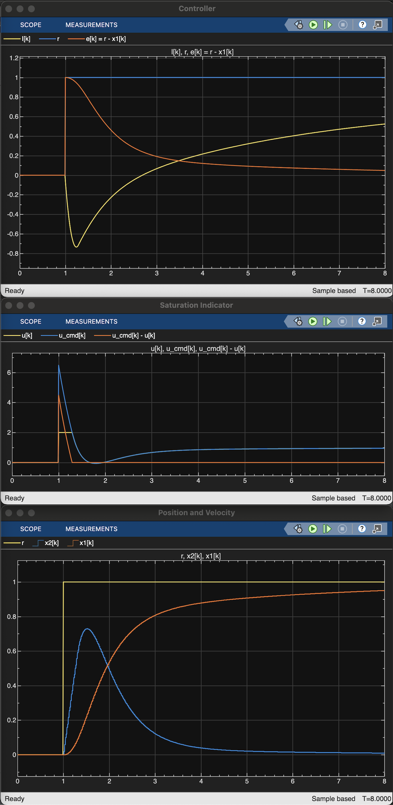

---

#### 4.2.1 Observed Baseline Behavior

Under the baseline configuration, the closed-loop system exhibits the following characteristics:

**Stability**

* The closed-loop response converges to a steady operating condition following the reference step.
* All transient oscillations decay, and no unstable or growing behavior is observed.

**Transient Response**

* The position response rises smoothly toward the reference with no overshoot.
* Velocity exhibits a single dominant transient consistent with well-damped second-order behavior.
* The transient behavior is dominated by a fast initial response followed by slower convergence driven by the integral term.

**Steady-State Behavior**

* The position converges to the reference value with negligible steady-state error.
* Integral action successfully eliminates residual bias without inducing slow oscillations.

**Control Effort**

* The commanded control signal remains largely within actuator limits.
* Brief saturation may occur during the initial transient, but saturation is not the dominant condition.
* Anti-windup logic remains active but is not yet stressed in a way that dominates system behavior.

---

#### 4.2.2 Interpretation

The baseline simulation confirms several critical points:

1. **Model correctness**
   The plant dynamics, controller structure, and signal flow are consistent and free of algebraic or numerical errors.

2. **Discrete-time fidelity**
   The backward-Euler integral implementation, derivative-on-measurement structure, and update ordering behave as intended.

3. **Controller sanity**
   Gains are physically reasonable and produce interpretable behavior.

4. **Readiness for tuning**
   The system is operating in a linear range where incremental changes to gains, plant parameters, disturbances, or saturation limits will produce observable and explainable effects.

Importantly, the absence of sustained saturation in the baseline is **not a deficiency**. It establishes a clean operating point from which saturation effects and anti-windup behavior can be introduced *deliberately* and analyzed in isolation.

---

#### 4.2.3 Role of the Baseline Going Forward

This baseline will be used as:

* the reference case for manual gain tuning comparisons
* the pre-disturbance condition for disturbance rejection studies
* the linear-operation benchmark before actuator limits are stressed
* the simulation counterpart for initial embedded validation

Any deviation from this configuration in later sections will be explicitly documented and justified.

---

### 4.3 Manual Gain Tuning and Lock-In Decision

#### 4.3.1 Purpose of Manual Tuning

Following establishment of the baseline closed-loop configuration, a structured manual tuning phase was conducted to explore the sensitivity of transient and steady-state behavior to controller gains and anti-windup strength.

The objective of this phase was **not** to achieve mathematically optimal performance, but to:

* build intuition for gain interactions in the discrete-time implementation
* observe saturation and recovery behavior directly
* identify a high-quality, physically interpretable operating point
* establish a credible hand-tuned reference prior to automated tuning

This manual process also served as a validation step, ensuring that controller behavior remained explainable and consistent across tuning iterations.

---

#### 4.3.2 Scope of Manual Sweeps

Manual tuning was performed by incremental, single-parameter adjustments while holding all other parameters fixed. The following gain ranges were explored:

* **Proportional gain** $K_p$: increased to study transient response speed (rise time) and overshoot sensitivity
* **Integral gain** $K_i$: increased to reduce steady-state error while monitoring its impact on transient overshoot and settling
* **Derivative gain** $K_d$: adjusted to control oscillatory behavior and limit overshoot during transients
* **Anti-windup gain** $K_{aw}$ adjusted to study integrator recovery behavior following actuator saturation

Each run was explicitly documented via scope captures, with parameters encoded directly into filenames to preserve traceability.

No multi-parameter or heuristic “search” was performed; all adjustments were deliberate and interpretable.

---

#### 4.3.3 Observations from Manual Tuning

Several consistent behaviors emerged across runs:

* Increasing $K_i$ improved rise time initially, but eventually increased overshoot and control effort.
* Increasing $K_p$ beyond a moderate range **degraded** rise time due to interaction with saturation and integral dynamics.
* Increasing $K_d$ reduced overshoot but produced diminishing returns beyond a narrow window.
* Increasing $K_{aw}$ significantly altered transient response by modifying integrator recovery following brief saturation events.

Notably, aggressive gains did not monotonically improve performance. In several cases, “more gain” resulted in **slower rise time**, increased peak excursion, or longer recovery.

> In runs with immediate actuator saturation, anti-windup action temporarily suppressed integral accumulation by driving the integrator negative during the initial transient. This behavior reduced early integral contribution and slightly slowed the initial rise toward the reference. However, it prevented excessive integrator buildup during saturation and improved overall recovery behavior once the actuator exited saturation.

---

### 4.4 Selected Manual Best Configuration (Run 14)

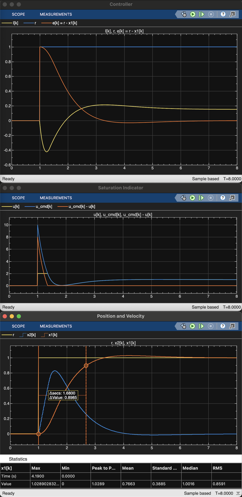

---

Based on quantitative metrics (rise time, overshoot, settling behavior) and qualitative assessment (smoothness, clear and predictable behavior, saturation recovery), the following configuration was selected as the best manual result:

**Controller Gains (Run 14)**

* $K_p$ = 10.0
* $K_i$ = 6.5
* $K_d$ = 6.5
* $K_{aw}$ = 0.6

**Performance Metrics (Run 14)**

 * Rise time 90%: 1.69 s
 * Overshoot: 2.89%
 * Settling time 2%: 4.09 s
 * Control energy: 6.79 $N^2 \cdot$ s
 * Composite cost: 9.43

**Engineering Characterization**
This configuration exhibits:
 * Smooth control action
 * Limited saturation duration
 * Conservative actuator usage
 * Good robustness margin

All plant and execution parameters remained unchanged from the baseline.

This configuration demonstrated:

* faster rise time than earlier runs without excessive overshoot
* clean saturation recovery with no visible integral windup
* stable steady-state convergence with negligible residual error
* velocity decay consistent with physical damping

Further manual sweeps around this point produced **marginal or negative improvements**, indicating diminishing returns from hand tuning.

---

### 4.5 Lock-In Decision

At this stage, additional manual tuning was judged to be inefficient and unlikely to produce meaningful improvement.

This decision was based on:

* performance improvements diminishing across successive tuning runs
* small gain adjustments producing unpredictable or conflicting changes in response
* transient behavior becoming dominated by actuator saturation rather than gain selection
* the absence-under the available MATLAB license-of autotuning capabilities that operate directly on a discrete-time implementation incorporating actuator saturation, anti-windup dynamics, and embedded execution effects

Accordingly, **Run 14 is locked in** as:

* the final manually tuned controller
* the reference point for automated tuning comparison
* the hand-tuned benchmark against which autotuned results will be evaluated

**This configuration (Run 14) was used as the reference point for automated gain optimization, rather than proceeding directly from the original baseline.**

---

#### 4.5.1 Growing Coupling Between Gains and Actuator Limits

By the time Run 14 was reached, it became clear that changes in PID gains were no longer producing the expected linear effects on system behavior.

Instead, response characteristics were increasingly determined by when saturation occurred and how long it remained active.

Closer inspection showed that this behavior arose from several related effects:

#### 4.5.1.1 Actuator Saturation Becomes Active Early and Often

With sufficiently aggressive proportional $(K_p)$ and integral gains $(K_i)$, the commanded control

$$
u_{\text{cmd}}[k] = K_p e[k] + K_i I[k] - K_d x_2[k]
$$

exceeds the actuator limits during the initial transient. Once saturation is engaged, the actuator output is clamped and the plant no longer experiences the full linear control law as computed; instead, it receives a clipped input determined by the saturation limits.

While saturated, modifications to controller gains alter the *commanded* control $u_{\text{cmd}}[k]$, but do not affect the *applied* control $u[k]$ until the commanded input is driven back within actuator limits.

#### 4.5.1.2 Gains Now Influence *When* and *How Long* Saturation Occurs

At this point, increasing $K_p$ or $K_i$ no longer behaved like simple increases in aggressiveness.

* **Earlier entry:** Increasing $K_p$ raises $|u_{\text{cmd}}|$ sooner after a step, causing the commanded control to cross the actuator limit earlier.
* **Greater depth:** Once saturation is reached, larger $K_p$ or $K_i$ pushes $u_{\text{cmd}}$ farther beyond the limit, increasing the oversaturation margin.
* **Longer duration / later exit:** A larger oversaturation margin takes longer to unwind, delaying the moment when $|u_{\text{cmd}}|$ returns within bounds and the controller regains authority.

As a result, rise time, overshoot, and settling behavior become dominated by **how long the system remains clipped**, rather than by linear closed-loop dynamics. Small adjustments to $K_p$ or $K_i$ can therefore produce disproportionate changes in transient timing because they shift both the **onset** and the **duration** of saturation.

#### 4.5.1.3 Integral action becomes indirectly shaped by saturation

Once saturation is active, the integral term is no longer driven primarily by $e[k]$. It is driven by the **anti-windup correction**
  
$$
K_{aw}\ (u[k] - u_{\text{cmd}}[k])
$$

This behavior revealed that:

* $K_i$ controls how strongly the integrator *wants* to accumulate error.
* $K_{aw}$ controls how strongly saturation *pushes back* on the integrator.
* The effective integral behavior is now a coupled function of $K_i$, $K_{aw}$, **and** the saturation limit.

Changing any one of these alters the others’ impact.

#### 4.5.1.4 Derivative Action Reshapes Saturation Exit and Recovery

Derivative action, implemented as velocity feedback $(-K_d x_2)$, does not generally cause saturation during the initial transient. Instead, it primarily affects **how and when the controller enters and exits saturation**, and how control effort recovers afterward.

Experiments with $K_d$ showed that:

* reduces the commanded control during positive velocity, shrinking the oversaturation margin and enabling earlier saturation exit,
* influences the strength and timing of deceleration once the controller exits saturation,
* influences the magnitude and timing of the anti-windup correction through its effect on $u_{\text{cmd}}$.

It became apparent that derivative action was influencing how the controller recovered from saturation, rather than simply adding damping in the linear sense.

#### Result: Tuning Becomes Non-Local and Non-Intuitive

Near Run 14, a small gain tweak could:

* slow the rise instead of speeding it up,
* reduce overshoot but increase settling time,
* improve one metric only by worsening saturation behavior elsewhere.

At this point, further progress required tools capable of navigating a coupled, constrained, nonlinear tuning landscape rather than continued one-parameter-at-a-time adjustment.

---

### 4.6 Transition to Automated Tuning

With a high-quality manual solution established, the next phase of the project transitions to automated gain optimization implemented in MATLAB.

Rather than relying on built-in autotuning tools, a custom tuning procedure was developed to evaluate controller performance directly against the same discrete-time implementation used for embedded verification.

The goals of autotuning are to:

* quantify achievable improvements beyond manual tuning
* compare algorithmic tuning against human intuition
* evaluate tradeoffs between performance and robustness
* assess whether automated gains remain physically interpretable and implementation-safe

**The autotuned controller will be evaluated relative to Run 14, not the original baseline.**

---

### 4.7 Optimization Method

Automated tuning was performed using a **derivative-free numerical optimizer** operating directly on the Simulink model.

Key characteristics of the tuning approach:

**Simulation-in-the-loop**
* Each candidate gain set was evaluated by running the full Simulink model.

**Discrete-time fidelity preserved**
* Sampling, saturation, and anti-windup behavior were fully active.

**Derivative-free optimization**

* Required because the cost function is not smooth with respect to the gains. Performance metrics are extracted from time-domain simulation and depend on nonlinear and discrete behaviors such as saturation, peak detection, and threshold crossings-which introduce piecewise and non-smooth variation of the cost with respect to the gains, making gradient-based methods unreliable.

**Guarded execution**
* Used to prevent the optimizer from converging in regions of the parameter space that, while numerically minimizing the cost function, do not represent meaningful or desirable controller behavior. An unguarded optimizer has no inherent understanding of which regions should be avoided; it will reduce the cost wherever possible, even if gain variations have little physical effect due to saturation, limited control limits, or other nonlinearities. Preflight checks ensure that the optimizer operates only in regions where changes in gains produce meaningful changes in closed-loop behavior, allowing cost reductions to reflect genuine performance improvements rather than artifacts of the search space.

**Graceful termination and checkpointing**
* Implemented to ensure robustness and recoverability of the simulation-based optimization process. Because each cost evaluation requires a full time-domain simulation, optimization runs are long-running and subject to interruption or failure. Intermediate and final results were therefore written to disk, allowing partial progress to be preserved, analyzed, and reused rather than lost, and ensuring that optimization outcomes remain reproducible and auditable.

---

The optimizer searched over:

* Proportional gain $K_p$
* Integral gain $K_i$
* Derivative gain $K_d$
* Anti-windup gain $K_{aw}$

---

### 4.8 Cost Function

The optimization objective minimized a composite cost function $(J)$ incorporating:

* rise time to 90 % of reference
* settling time (2 % criterion)
* overshoot penalty
* control effort (energy)

This formulation intentionally balances **transient performance** against **control aggressiveness**, avoiding solutions that achieve fast response at the expense of actuator abuse or instability.

---

### 4.9 Solver Configuration

Autotuning was performed using:

**Solver**: fminsearch (Nelder–Mead)

**Approach**: Derivative-free optimization

**Initialization**: Multi-start (6 initial conditions) from different initial gain guesses, rather than relying on a single starting point. Derivative-free solvers such as Nelder–Mead are local optimizers that do not see the entire cost surface and can converge to different solutions depending on initialization. Multi-start initialization reduces sensitivity to starting conditions and improves robustness against convergence to suboptimal regions.

**Bounds**: Logistic transform on gains. Nelder–Mead does not support explicit constraints, so gains were bounded using a smooth logistic transform. This allows the solver to push gains toward their limits indefinitely, while the actual gain values approach those limits asymptotically rather than encountering a hard wall. As a result, the solver operates as if it were exploring an infinite parameter space, while all evaluated gains remain within safe and physically meaningful bounds.

**Verification**: Preflight checks confirmed that gain changes produced observable changes in closed-loop behavior, preventing optimization in regions where saturation or nonlinearities masked controller influence.

**Robustness features**:
* Periodic checkpointing to disk
* Explicit cleanup and resource release
* Guaranteed final save

The solver infrastructure was validated through repeated trial runs before accepting final optimization results.

---

#### 4.9.1 What the solver solves for

The solver **only optimizes the controller gains**:

$$
\theta = {K_p,\ K_i,\ K_d,\ K_{aw}}
$$

It searches for the gain vector that minimizes a **scalar cost** $J(\theta)$.

The optimization problem is:

$$
\text{min}\ J(\theta)
$$

where

$$
J(\theta)= w_r\ t_{r90}(\theta)+ w_o\ \max\left( OS(\theta)\,\ 0 \right) + w_s\ t_s(\theta)+ w_u\ E_u(\theta)
$$

Key point:

* $J$ is a **function of gains**
* The weights are **constants inside that function**

Mathematically, the solver operates on:

“Given this scalar function $J(\theta)$, find $\theta$ that makes it small.”

There is **no outer loop** that adjusts the weights.

The solver uses the gains already defined in the Simulink model (run 14) at runtime.
Those gains are read, mirrored, simulated as the baseline, and used as the initial condition for optimization.
**No numerical gains are hard-coded inside the solver script.**

Here are the exact weights used:

* w.rise90    = 1.0
* w.overshoot = 1.5
* w.settle2   = 0.5
* w.uEnergy   = 0.2

So numerically:

$$
J= 1.0 \cdot t_{r90}+ 1.5 \cdot \text{OS}+ 0.5 \cdot t_s+ 0.2 \cdot E_u
$$

where:

* $t_{r90}$ = rise time to 90% of final value (seconds)
* OS = percent overshoot (percent units, clipped at ≥ 0)
* $t_s$ = 2% settling time (seconds)
* $E_u = \int u^2(t)\ dt$ = control energy (actuator workload over time)

In practice, control energy is computed in discrete time over a finite-time horizon as:

$$
E_u \approx \sum_{k=0}^{N} u[k]^2\ T_s
$$

using the logged control signal from simulation or embedded execution.
> When saturation and sustained disturbances create a biased operating point, $E_u$ should be read as **actuator workload**, and must be interpreted alongside tracking error (bias), not as a standalone performance score.
---

#### Important clarifications

* These weights are hard-coded
* They do not change during optimization
* They are not solved for
* They are not adapted based on performance

They are part of the **problem definition**, not the solution.

---

#### 4.9.2 Engineering interpretation

Relative emphasis implied by the weights:

* **Overshoot (1.5)** is penalized most strongly
* **Rise time (1.0)** is the next priority
* **Settling time (0.5)** matters, but less aggressively
* **Control effort (0.2)** is a soft penalty on actuator workload

So the solver is being told, in effect:

> “Prefer low overshoot first, then fast rise, then reasonable settling, and avoid excessive control effort-but don’t sacrifice transient performance just to minimize effort.”

That intent is entirely encoded by these four numbers.

Controller gains were optimized by minimizing a weighted scalar cost combining rise time, percent overshoot, 2% settling time, and control energy, with fixed weights (1.0, 1.5, 0.5, 0.2) respectively.

---

### 4.10 Autotuned Result

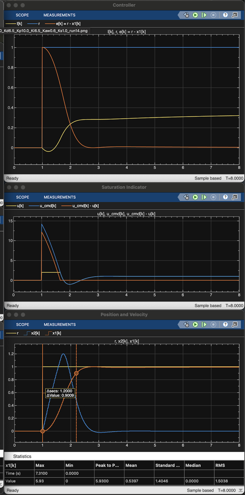

---

The optimizer converged to the following gain set:

**Autotuned Gains**

* $K_p$ = 14.18
* $K_i$ = 2.92
* $K_d$ = 5.92
* $K_{aw}$ = 0.108

**Observed Performance**

* Rise to 90%: 1.20 s
* Overshoot: $\approx$ 0%
* Settling time (2%): 1.47 s
* Control energy: 8.34
* Cost J: 3.60

---

### 4.11 Comparison of Autotuned to Manual Best (Run 14)

| Gain     | Run 14 (Manual) | Autotuned |
| -------- | --------------- | --------- |
| $K_p$    | 10.0            | 14.18     |
| $K_i$    | 6.5             | 2.92      |
| $K_d$    | 6.5             | 5.92      |
| $K_{aw}$ | 0.6             | 0.108     |
---

| Metric         | Manual (Run 14) | Autotuned  |
| -------------- | --------------- | ---------- |
| Rise to 90%    | 1.69 s          | **1.20 s** |
| Overshoot      | 2.89%           | **~0%**    |
| Settling (2%)  | 4.09 s          | **1.47 s** |
| Control Energy (total) $\int u^2\,dt$ | 6.79            | **8.34**      |
| Cost J         | 9.43            | **3.60**   |
---

**Key observations:**

* The autotuned controller achieved **significantly faster rise and settling**.
* Overshoot (on position $x_1$) was effectively eliminated.
* Control effort increased modestly but remained well-behaved.
* Anti-windup gain was driven substantially lower, altering how integral action interacted with saturation.

#### 4.11.1 Engineering Interpretation

The autotuned result does not represent a fundamentally different control strategy. Rather, the optimizer systematically traded integral dominance and anti-windup strength for increased proportional speed and faster transient response, operating with higher control effort and reduced headroom relative to the manual solution.

This behavior made an important control tradeoff explicit: the improved transient response was achieved by accepting higher control effort and operating closer to actuator limits, which reduces tolerance to modeling error, disturbances, and saturation effects. The optimizer minimized the cost function as posed; it did not alter the underlying system dynamics or invalidate the manual design, but systematically exposed a tradeoff that was not apparent prior to the tuning exercise.
 
Several important conclusions emerge from this comparison:

1. **Manual tuning was high quality**

   Run 14 represented a strong, physically sensible operating point. The optimizer did not correct a “bad” controller-it refined a good one.

2. **Algorithmic tuning exploited non-intuitive tradeoffs**

   The optimizer reduced integral gain while increasing proportional speed, relying more heavily on fast transient response than accumulated error correction.

3. **Anti-windup dynamics matter more than expected**

   The significant reduction in $K_{aw}$ highlights how strongly anti-windup dynamics shape transient behavior even when saturation is brief.

4. **The resulting response remained stable in all evaluated scenarios and retained clear, physically interpretable, and predictable behavior**

   The resulting response remains physically interpretable and suitable for embedded implementation.

---

### 4.12 Final Gain Selection Decision

Although the autotuned gains achieve superior rise and settling times, the manually tuned Run 14 configuration is retained as the **final selected controller** for this project.

This decision reflects an explicit engineering judgment favoring:

* smoother control action
* reduced saturation stress
* greater robustness margin
* clear, physically interpretable, and predictable behavior

The autotuned gains are retained as a **reference performance envelope**, establishing an upper bound on achievable speed under the given constraints, but are not adopted as the baseline configuration.

---

## 5. Embedded Implementation

The embedded implementation is used to execute the discrete-time controller under realistic timing and real-time scheduling, floating-point arithmetic, and execution ordering while preserving consistency with the simulation model.

The goal of this phase is not to introduce hardware-specific behavior into the plant, but to validate that the controller behaves as expected when executed as real code with a fixed update rate and finite numerical precision.

---

### 5.1 Hardware Platform

The embedded execution of the mass–spring–damper system was performed entirely on an STM32 F411RE microcontroller. No physical sensors or actuators were used; the plant dynamics were executed numerically on the MCU.

* **MCU:** STM32 (ARM Cortex-M class)
* **Sensors:** None (plant state is internal and directly observable)
* **Actuators:** None (control effort is numerically saturated and applied to the simulated plant)
* **Power considerations:** USB-powered operation; electrical loading effects are not relevant

This configuration preserves real-time scheduling, floating-point arithmetic, and execution ordering, while eliminating mechanical and electrical variability that is not relevant to verification objectives. As a result, deviations observed in Section 6 can be attributed to **modeled non-idealities**, not hardware artifacts.

---

### 5.2 Software Architecture

The firmware architecture enforces clear separation between **hardware abstraction**, **control logic**, and **experimental features**.

**HAL vs application separation**

STM32 HAL (Hardware Abstraction Layer) is used exclusively for peripheral configuration (clock, UART, timing services). The plant model, controller, and all non-idealities reside in application code, ensuring that control behavior is independent of HAL implementation details.

**Timing model**

  The control loop executes at a fixed nominal sample period $T_s$ = 0.01, consistent with the Simulink reference model.

  Loop timing is enforced using a software delay within the main execution loop rather than a hardware timer interrupt. This approach was selected to keep the runtime execution path simple and easily traceable during verification, acknowledging that it introduces timing jitter relative to a timer-driven implementation. For the behaviors evaluated in Phase 1, this level of timing variability does not materially affect the observed control tradeoffs or conclusions.

  A hardware timer–driven implementation (ISR or timer-set execution flag) would provide superior determinism and is the preferred approach for production systems or studies where timing jitter is a first-order concern.

**Interrupts vs main loop**

  Interrupts are limited to peripheral servicing (e.g., UART), with all control computations executed outside interrupt context. This choice localizes control logic for this verification phase; a timer-driven ISR or execution flag would be preferred where tighter timing determinism is required.

**Feature flags / debug isolation**

  Saturation, disturbance injection, and measurement noise are each isolated behind compile-time feature flags. When disabled, these features introduce zero side effects, preserving the baseline behavior established in Phase 0 and referenced throughout Section 6.

---

### 5.3 Control Loop Implementation

The control loop executes a complete **sense → compute → actuate → log** sequence at each sample.

* **Control rate**
  The control update rate matches the discretization used in Simulink, enabling direct embedded–simulation comparison in Sections 6.

* **Data flow**
  At each sample:

  1. The plant state is advanced using the discrete-time mass–spring–damper equations
  2. Measurement noise (if enabled) is applied to the measured states
  3. Control error is computed from the measured position
  4. The PID control law is evaluated
  5. Actuator saturation and anti-windup logic are applied
  6. All relevant signals are logged via UART using a fixed CSV format

* **Numerical considerations**
  All computations are performed in floating point. Over the evaluated simulation durations, no numerical drift or instability was observed.

* **Fixed vs floating point**
  Floating-point arithmetic was selected to preserve direct correspondence with the Simulink model and to avoid introducing quantization effects outside the scope of this project.

---

## 6. Embedded Validation with Modeled Non-Idealities

### 6.1 Test Setup

All hardware validation experiments are performed on the STM32 F411RE microcontroller executing the same discrete-time mass–spring–damper plant and PID controller used in simulation.

The embedded system runs a fixed-rate control loop. At each sample, the plant state, controller state, and control output are updated using explicit difference equations. The execution order and signal definitions were implemented to mirror those used in the simulation model.

Relevant signals are logged over UART using a fixed CSV format. Logged data is analyzed offline in MATLAB. Time is reconstructed from sample index to ensure consistent alignment between simulation and embedded results.

Non-ideal effects such as actuator saturation, disturbance injection, and measurement noise are isolated behind compile-time feature flags. When disabled, these features do not affect baseline execution. This allows individual effects to be enabled or disabled without altering the core control logic.

Unless explicitly stated otherwise, all experiments in this section use the same sampling period, plant parameters, controller structure, and signal definitions as the corresponding simulation cases.

---

### 6.2 Purpose
The purpose of Phase 1 is to determine whether observed behavior follows directly from modeled constraints. Performance degradation that is physically explainable is treated as validation, not failure.

---
### 6.3 Phase 0 - Embedded Baseline Equivalence

Phase 0 of this project established a trusted baseline for embedded execution and validation prior to introducing additional non-idealities. The discrete-time mass–spring–damper plant and the discrete-time PID controller (including saturation and back-calculation anti-windup) were executed on the STM32 at a fixed sampling period of $T_s$ = 0.01 s. Logging was performed via UART and analyzed in MATLAB with time reconstructed from sample index.

#### **6.3.2 Phase 0 - Embedded Controller Verification (Run 14)**

**Purpose:**
Verify close behavioral agreement between the Simulink controller model and the embedded implementation using the locked manual gains (Run 14)

**Method:**

* Execute the embedded controller with identical gains and sampling period
* Log internal controller signals and plant states
* Post-process logs in MATLAB
* Compute standard time-domain performance metrics
* Compare against simulation expectations

---

**Phase 0 Response Curves - Embedded Verification of Simulink Model**

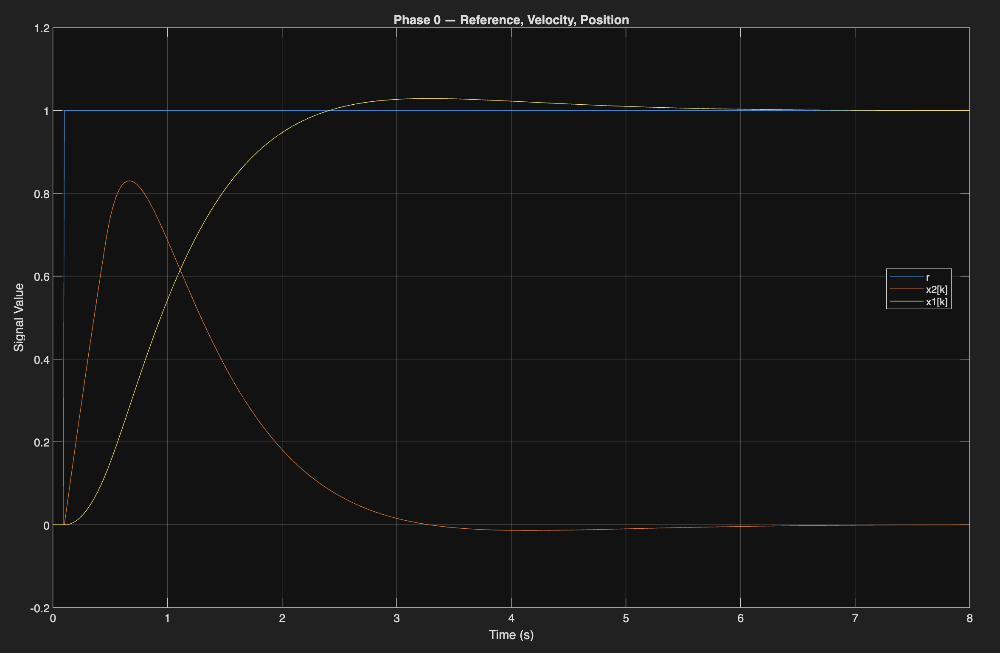

---
**Phase 0 Control Output and Saturation Effect Curves - Embedded Verification of Simulink Model**

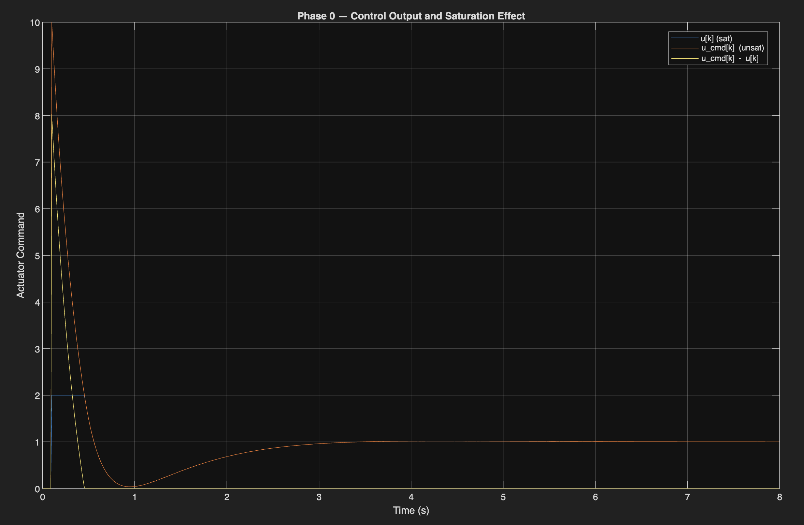

---
**Phase 0 Integrator and Reference Error Curves -Embedded Verification of Simulink Model**

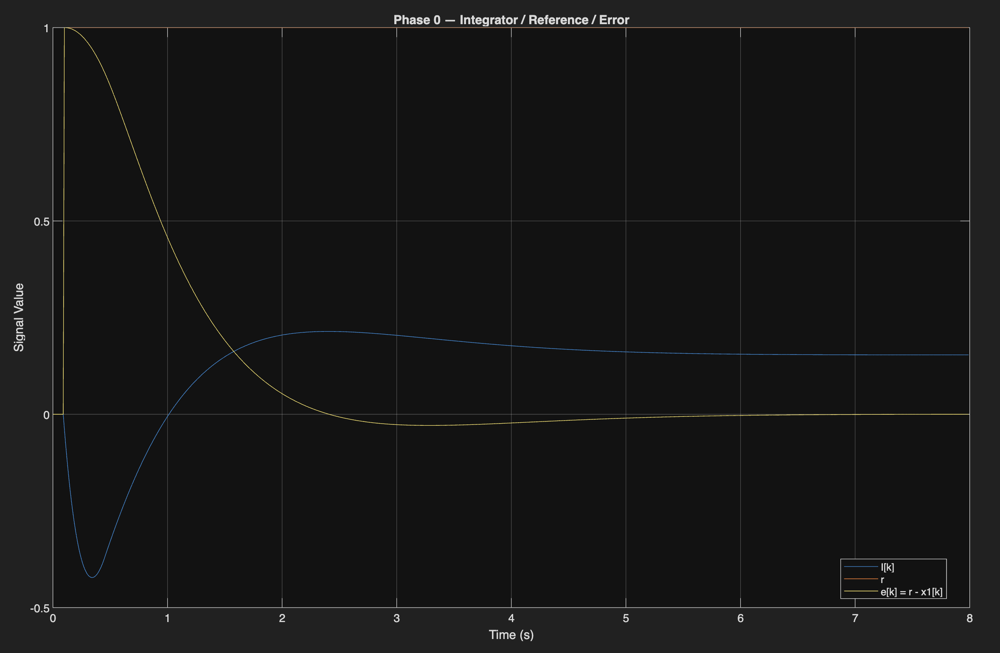

---

#### 6.3.3 Key verification results

The expected error is defined as:

$$
e_{\text{expected}}[k] = r[k] - x_1[k]
$$

This value is compared against the firmware-logged error to form a residual:

$$
\Delta e[k] = e_{\text{expected}}[k] - e_{\text{logged}}[k]
$$

The verification metric reports the worst-case disagreement over the run:

$$
\max_k |\Delta e[k]| = 1\times10^{-6}
$$

**Error definition consistency.**
The logged error signal matches the analytical definition within numerical tolerance, confirming correct error computation.

**Closed-loop response consistency.**
The embedded step response is consistent with the Run 14 reference behavior and provides a verified baseline for subsequent phases:

* rise time (90%) = 1.36 s
* overshoot = 2.89%
* settling time (2%) = 4.09 s
* steady-state error ≈ 0

**Metrics and repeatability infrastructure.**
The MATLAB plotting script generates standardized plots and extracts step-response metrics directly from the embedded log, establishing a repeatable analysis path for subsequent actuator-realism and disturbance/noise phases.

---

### 6.4 Comparison of Phase 0 to Manual Best (Run 14), and Autotuned Results

| Metric         | Manual (Run 14) | Autotuned  | Phase 0 (Embedded Verification) |
| -------------- | --------------- | ---------- | ------------------------------- |
| Rise to 90%    | 1.69 s          | **1.20 s** | 1.36 s                          |
| Overshoot      | 2.89%           | **~0%**    | 2.89%                           |
| Settling (2%)  | 4.09 s          | **1.47 s** | 4.09 s                          |
| Control Energy (total) $\int u^2\,dt$ | 6.79            | 8.34       | 7.69                            |
| Cost J         | 9.43            | **3.60**   | -                               |

> Note: Cost J is defined only for automated optimization and is not applicable to Phase 0 embedded verification results.

#### 6.4.1 Engineering Interpretation

The faster rise observed in the embedded implementation arises from differences in how discrete updates propagate through the control loop. In firmware, control outputs take effect immediately after computation, whereas the Simulink model applies updates through a scheduled signal-flow structure that delays output application until the entire block diagram has been resolved. This results in slightly delayed initial actuation in simulation and produces a modestly sharper transient in the embedded case without altering the underlying control logic.

The observed rise-time discrepancy is interpreted as a timing-related artifact of discrete execution rather than a difference in controller structure or tuning; however, this interpretation does not exclude other contributing factors outside the scope of this project.

---

###  6.5 Phase 0 Conclusions

* The embedded controller exhibits consistent closed-loop behavior relative to the Simulink reference model
* Logged error identity confirms internal consistency
* The firmware implementation is validated and ready for Phase 1

Phase 0 confirms that the embedded implementation and logging pipeline are correct and stable under idealized conditions, enabling future deviations to be attributed to deliberate non-idealities rather than implementation errors.

---

## 7.0 Phase 1A - Actuator Saturation Stress Test (Reduced Limit)

**Purpose**

Phase 1A evaluates the closed-loop behavior of the embedded controller when actuator limits are deliberately tightened, with the goal of stressing saturation and anti-windup dynamics while preserving stability and clear and predictable behavior.

Unlike Phase 0, where saturation was present but not dominant, this phase intentionally constrains available control limits to examine:

* interaction between integral action and actuator limits
* recovery behavior after saturation clears
* sensitivity of transient metrics to reduced actuation
* robustness of the back-calculation anti-windup strategy

This test isolates **actuator realism** as the sole new non-ideality; all other parameters remain unchanged. This constraint is intentional and preserves causal observability.

---

### 7.1 Configuration

The Phase 1A configuration is identical to the Phase 0 embedded setup except for the actuator saturation limit.

**Plant Parameters**

* Mass: $m$ = 1
* Damping coefficient: $b$ = 0.2
* Spring constant: $K_s$ = 1

**Controller Gains (Locked Manual Best - Run 14)**

* $K_p$ = 10.0
* $K_i$ = 6.5
* $K_d$ = 6.5
* $K_{aw}$ = 0.6

**Execution Parameters**

* Sampling period: $T_s$ = 0.01 s
* Discrete-time controller, fixed-step
* Derivative on measurement (velocity feedback)
* Integral implemented as an explicit state using backward Euler

**Actuator Model**

* Saturation limit reduced from $\pm$ 2.0 to $\pm$ 1.5
* Symmetric saturation
* No rate limiting or additional nonlinearities introduced

---

### 7.2 Method

The embedded controller was executed with the reduced saturation limit while logging all internal signals using the established CSV format. Time was reconstructed from the sample index, and performance metrics were computed in MATLAB using the same frozen definitions used in Phase 0 to ensure direct comparability across phases.

---

### 7.3 Observed Behavior

**Phase 1A Response Curve - Saturation Increased to $\pm$ 1.5**

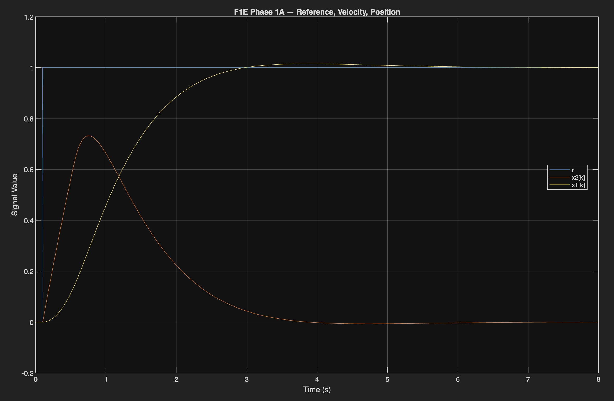

---
**Phase 1A Control Output and Saturation Effect Curves - Saturation Increased to $\pm$ 1.5**

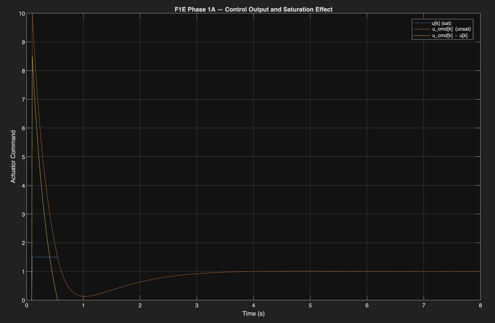

---
**Phase 1A Integrator and Reference Error Curves - Saturation Increased to $\pm$ 1.5**

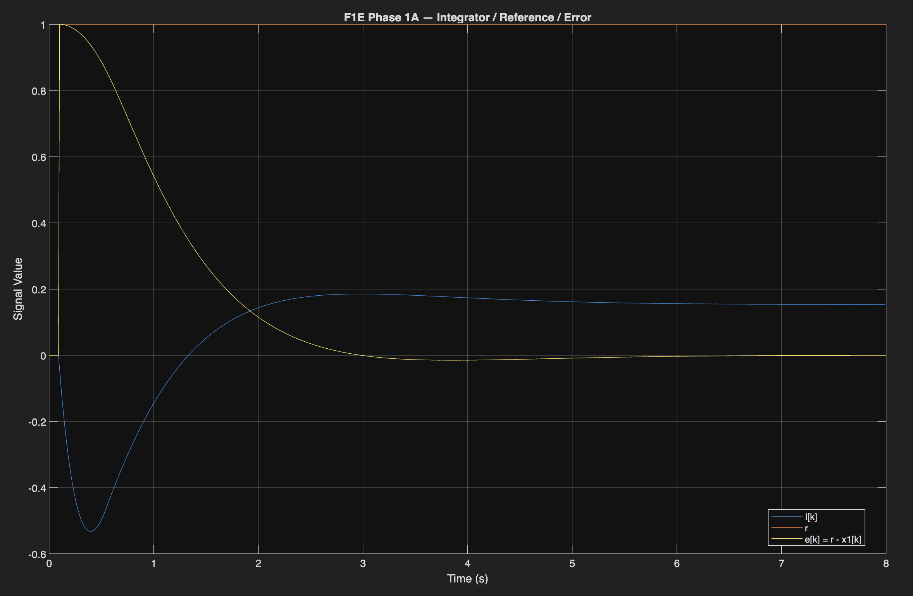

---

#### 7.3.1 Qualitative Results

With the reduced actuator limits, the system remains well-behaved and converges cleanly to the reference and exhibits the following qualitative characteristics:

1. Saturation Engagement During the Initial Transient
* Control Output & Saturation plot (middle):
  * The commanded control exceeds ±1.5 immediately after the step.
  * The applied control is clipped at ±1.5 without visible oscillation or chatter.
  * The actuator output clips at ±1.5 during the initial transient and then returns smoothly to the linear region.

  Saturation occurs during the initial transient when the commanded control exceeds the actuator limits. The controller requests more force than the actuator can deliver, and the commanded control is constrained by the implemented actuator saturation logic. The system proceeds in a controlled manner, and the actuator does not re-enter saturation after the initial transient.

2. Position Overshoot is Reduced Relative to Phase 0
* Control Output plot (middle):
  * After leaving saturation, $u[k]$ (sat) transitions smoothly into  linear operation.
  * No discontinuities, spikes, or reversals in control effort appear at desaturation.

* Position response (top):
  * The position trajectory approaches the reference smoothly.
  * Overshoot is **reduced** relative to Phase 0, not increased.

  No control spike or position overshoot is observed at saturation release. The response transitions smoothly into linear operation. The system exits saturation in a controlled manner, indicating the controller state (especially the integrator) is already aligned with the post-saturation operating point.

3. Well-Damped Velocity Response Consistent with Physical Damping
* Velocity trace (top):
  * Velocity peaks once and decays monotonically.
  * No secondary oscillations or ringing after saturation clears.

* Integrator plot (bottom):
  * Velocity does not exhibit any secondary peak following the initial transient.

  Here, velocity decays smoothly without secondary oscillation, indicating:

  * derivative action remains effective,
  * saturation does not introduce additional dynamic effects beyond the initial transient,
  * no delayed energy release from internal controller states.

---

4. No Evidence of Integral Windup or Latent Stored Error
* Integrator state (bottom):
  * The integrator briefly moves negative during saturation (expected).
  * It then reverses smoothly and converges to a small steady value.
  * No sharp jump or delayed correction occurs after desaturation.

* Error trace (bottom):
  * Error decays monotonically toward zero.
  * Error decreases toward zero and does not increase again after saturation clears.

* Windup would manifest as:
  * large integrator magnitude during saturation, and
  * a delayed, aggressive correction afterward.

  This behavior aligns with the intended role of the anti-windup mechanism.

---

5. Clean Steady-State Convergence Once Saturation Clears
* Position (top):
  * Final value settles very near 1.0 with negligible steady-state error.

* Control output (middle):
  * Control converges smoothly to its steady-state value without oscillation.

* Integrator (bottom):
  * Settles to a small constant consistent with disturbance-free equilibrium.

* Despite the reduced saturation limit, the controller retains adequate actuation capability to:

  * eliminate steady-state error, and
  * maintain equilibrium without persistent saturation.

---
6. Anti-Windup Influences the Transient Response

* The integrator state evolves during saturation without accumulating stored error.
* Control effort during saturation is not purely proportional/derivative driven (middle plot).
* The exit from saturation produces no abrupt transitions (top & middle).
* When saturation clears, the controller resumes normal operation without requiring corrective action from the integrator.

---

**Summary**

Reducing the saturation limit from ±2.0 to ±1.5 makes saturation a visible part of the transient response.

The plots show:

* monotonic position and velocity trajectories,
* smooth transitions into and out of saturation,
* no secondary peaks or delayed response,
* integrator behavior that settles without corrective surges.

Across all signals, the response degrades smoothly rather than abruptly. Saturation alters timing and amplitude but does not introduce irregular behavior or destabilizing effects.

---

#### 7.3.2 Quantitative Results

**Phase 1A Performance Metrics (Embedded Execution)**

* Rise time (90%): 1.60 s
* Settling time (2%): 2.57 s
* Peak value: 1.015
* Percent overshoot: 1.49
* Steady-state error: -2.08 x $10^{-4}$
* Control energy: 6.98

Relative to Phase 0, rise time increases, while overshoot and steady-state error remain small.

| Metric         | Manual (Run 14) | Autotuned  | Phase 0 (Embedded Verification) | Phase 1A (Embedded sat = 1.5) |
| -------------- | --------------- | ---------- | ------------------------------- | ----------------------------- |
| Rise to 90%    | 1.69 s          | **1.20 s** | 1.36 s                          | **1.60 s**                    |
| Overshoot      | 2.89%           | **~0%**    | 2.89%                           | **1.49%**                     |
| Settling (2%)  | 4.09 s          | **1.47 s** | 4.09 s                          | **2.57 s**                    |
| Control Energy (total) $\int u^2\,dt$ | 6.79            | 8.34       | 7.69                            | **6.98**                      |
| Cost J         | 9.43            | **3.60**   | -                               | -                             |

---

#### 7.3.3 Engineering Interpretation (Phase 1A: Reduced Actuator Limits)

Several conclusions emerge from Phase 1A when the actuator saturation limit is reduced from $\pm$ 2.0 to $\pm$ 1.5:

1. **The actuator limit affects the transient response**

   Reducing the saturation limit produces clear changes in rise time and control effort, showing that actuator constraints play a direct role in shaping the transient behavior.

2. **The controller continues to operate without sustained reliance on saturation**

   Even with tighter saturation bounds, the commanded control effort remains mostly within the allowable range, and saturation is brief. The controller does not appear to depend on sustained clipping to achieve the response.

3. **Anti-windup behavior remains effective during and after saturation**

   The integral state remains bounded during saturation and converges smoothly after desaturation, validating the back-calculation formulation and confirming that no latent integral energy is released once actuator limits are cleared.

4. **Reduced actuator limits transient energy application**

   The decrease in settling time observed in Phase 1A, despite reduced actuator limits, is due to lower transient kinetic energy rather than improved controller aggressiveness. By constraining peak control force, the system accelerates more gradually and stores less energy during the initial response, reducing the amount of energy that must be dissipated before the state enters and remains within the 2% tolerance band. This effect produces shorter settling even as rise time modestly increases.

   Greater allowable force enables faster motion, but does not guarantee faster settling unless damping and energy dissipation are proportionally increased.

5. **Transient performance degrades gracefully under reduced actuator limits**

   Despite reduced actuator limits, overshoot decreases and settling time improves relative to Phase 0, indicating that the controller retains actuator headroom and does not depend on operating at the saturation limit to achieve acceptable performance.

6. **The controller operates in a physically credible linear range**

   The system maintains stable, well-damped behavior even when actuator capability is meaningfully constrained. Preserved actuator headroom under these conditions increases confidence that the controller will remain robust when exposed to unmodeled disturbances or further reductions in available control actuation.

---

### 7.4 Phase 1A Conclusion

Phase 1A confirms that the locked manual controller (Run 14) maintains stability, tracking accuracy, and clear and predictable behavior under reduced actuator limits. Saturation behavior is well-controlled, recovery is smooth, and no adverse interactions between integral action and actuator constraints are observed.
 
This phase establishes a validated control output-limited operating envelope, providing a solid foundation for subsequent disturbance rejection and noise sensitivity studies.

---

## 8.0 Phase 1B - Disturbance Rejection Under Actuator Constraints

**Purpose**

Phase 1B evaluates the ability of the embedded controller to reject a sustained external disturbance while operating under reduced actuator limits.

Where Phase 1A isolated actuator saturation effects, Phase 1B introduces a constant external disturbance input to assess:

* steady-state error rejection via integral action
* transient recovery behavior after disturbance onset
* interaction between disturbance rejection and actuator saturation

---

### 8.1 Configuration

The Phase 1B configuration is identical to Phase 1A except for the introduction of a disturbance input.

**Plant Parameters**

* Mass: $m$ = 1
* Damping coefficient: $b$ = 0.2
* Spring constant: $K_s$ = 1

**Controller Gains (Locked Manual Best - Run 14)**

* $K_p$ = 10.0
* $K_i$ = 6.5
* $K_d$ = 6.5
* $K_{aw}$ = 0.6

**Execution Parameters**

* Sampling period: $T_s$ = 0.01 s
* Discrete-time controller, fixed-step
* Derivative on measurement (velocity feedback)
* Integral implemented as an explicit state using backward Euler

**Actuator Model**

* Symmetric saturation limits: $\pm$ 1.5
* No rate limiting or additional nonlinearities

**Disturbance Model**

* Disturbance input enabled
* Disturbance magnitude: -0.3 N, -0.5 N
* Disturbance type: **constant bias force**
* Disturbance activation time: $t$ = 4.00 s

 The -0.3 N disturbance magnitude was selected to remain within the available control output limits. At steady state, velocity and acceleration are zero, yielding the static force balance
 
 $$
 K_s x = u + d.
 $$
 
 With $K_s = 1$, $x_ref = 1$, and $d = -0.3$, the required steady-state control effort is
 
 $$
 u = K_s x - d = 1 - (-0.3) = 1.3,
 $$
 
which remains below the saturation limit of ±1.5. This ensures the disturbance can be fully rejected at steady state while still requiring integral action to supply the additional control effort.

 The -0.5 N disturbance was selected to push the controller close to its steady-state actuator limit (1.5), allowing evaluation of disturbance rejection behavior near saturation.

---

#### 8.1.1 Method

The embedded controller is executed with the disturbance enabled while logging all internal controller states and plant signals using the established CSV format.

Time reconstruction, error validation, and performance metric computation follow the same frozen analysis pipeline used in Phases 0 and 1A to ensure comparability.

---

### 8.2 Observed Behavior

#### 8.2.1 Phase 1B Response Curve -0.3 N Disturbance

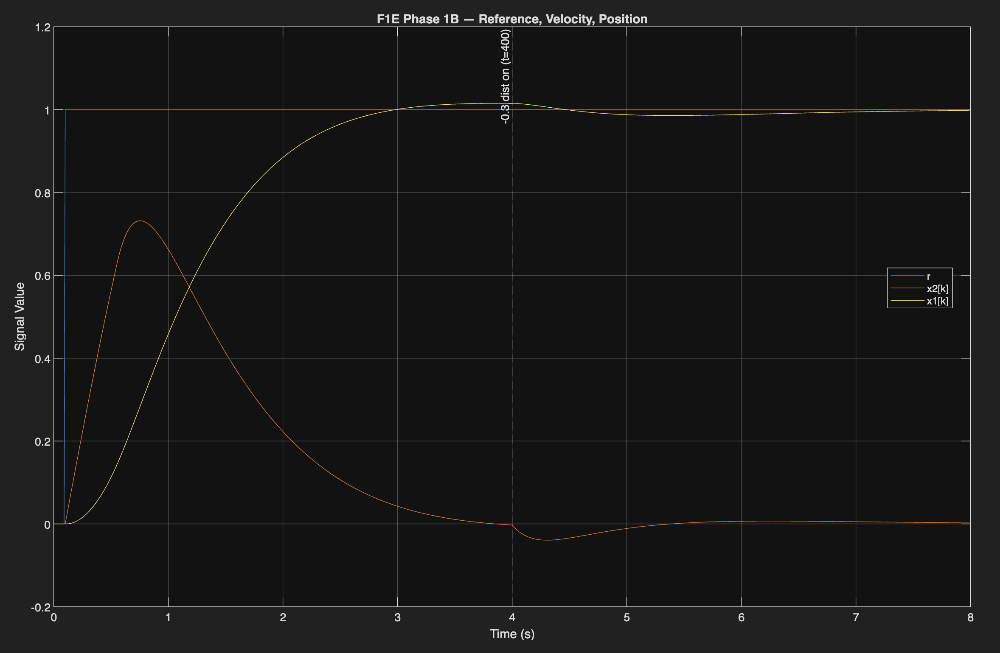

---
**Phase 1B Control Output and Saturation Effect Curves -0.3 N Disturbance**

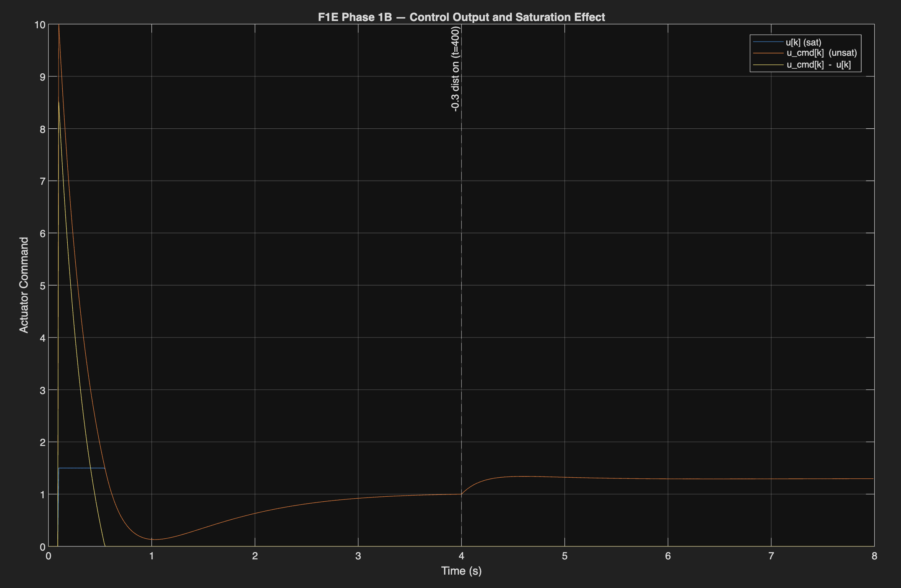

---
**Phase 1B Integrator and Reference Error Curves -0.3 N Disturbance**

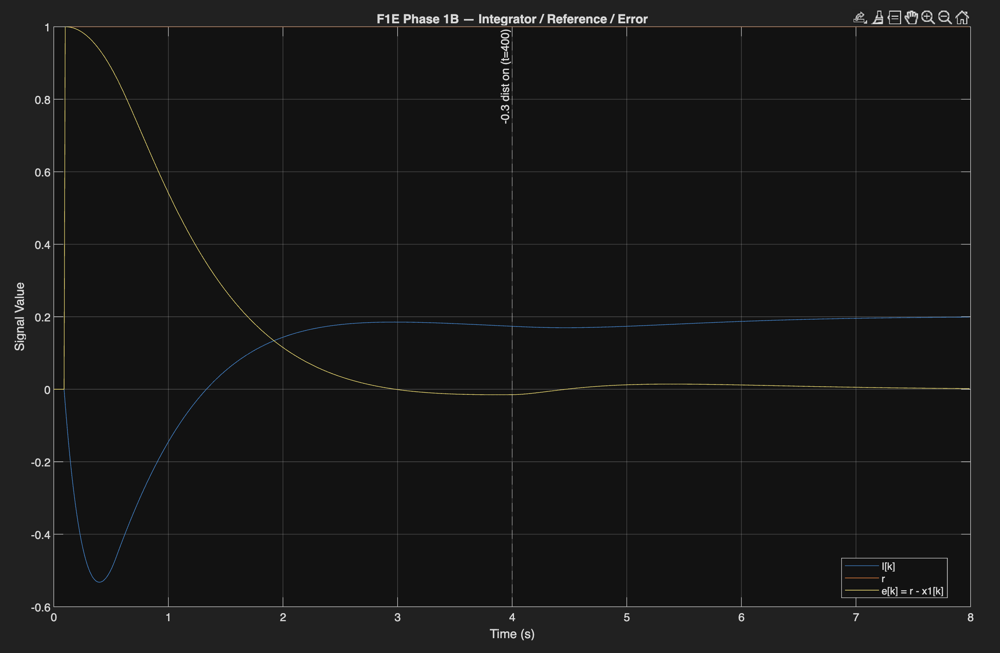

---

#### 8.2.2 Phase 1B Response Curve -0.5 N Disturbance

---

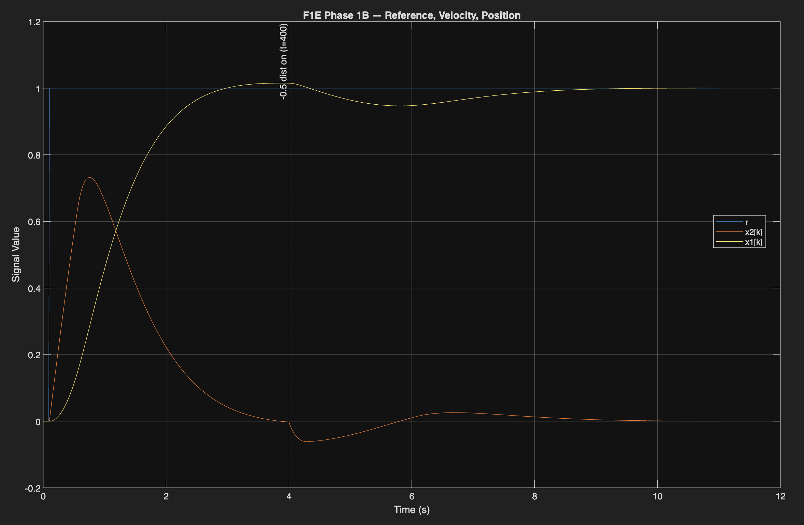

---
**Phase 1B Control Output and Saturation Effect Curves -0.5 N Disturbance**

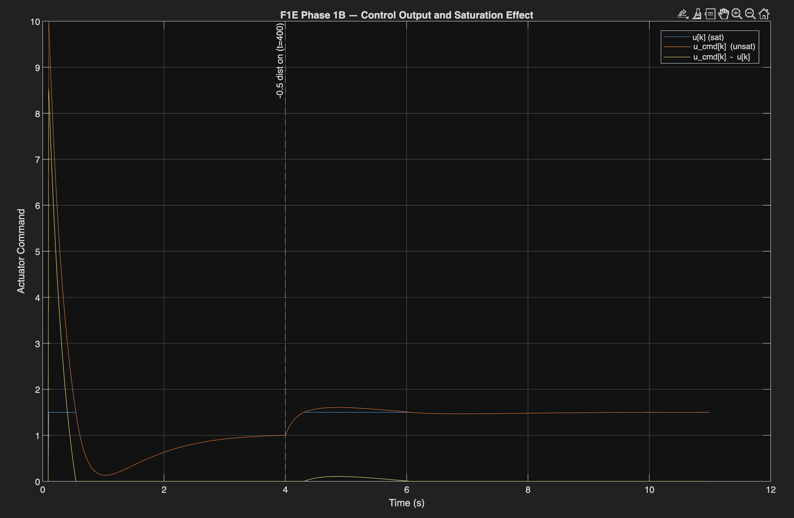

---
**Phase 1B Integrator and Reference Error Curves -0.5 N Disturbance**

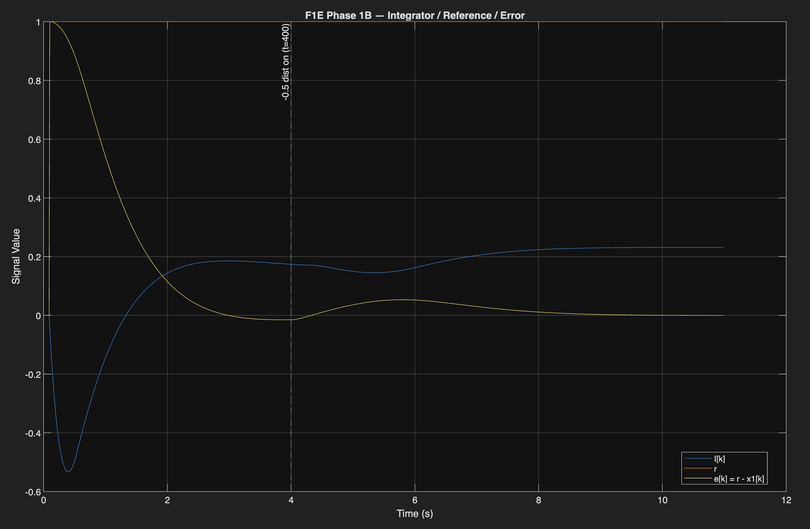

---

With a constant negative bias force applied at the specified disturbance onset time, the closed-loop system remains stable and recovers while operating near the actuator limit.

#### 8.2.3 Qualitative Observations

* The disturbance produces an immediate position deviation in the direction of the applied load, proportional to the applied load.
* Integral action increases smoothly following disturbance onset, driving the steady-state error toward zero.
* Actuator saturation is briefly engaged following disturbance onset but does not persist once equilibrium is re-established.
* No integrator windup or limit-cycle behavior is observed.
* The system returns to the reference position without oscillatory divergence or instability.

The qualitative response remains consistent across disturbance magnitudes tested, with a larger disturbance producing proportionally larger transient deviations and longer recovery times.

---

#### 8.2.4 Quantitative Results

**Phase 1B Performance Metrics (Embedded Execution)**

Two disturbance magnitudes were evaluated to characterize disturbance tolerance:

| Metric                            | dist = -0.3 N | dist = -0.5 N |
| --------------------------------- | ------------- | ------------- |
| Rise time (90%)                   | 1.98 s        | **1.98 s**    |
| Percent overshoot                 | 1.51%         | **1.51%**     |
| Settling time (2%)                | 2.56 s        | **7.36 s**    |
| Control energy (total) $\int u^2\,dt$           | 9.64          | **11.63**     |
| Control energy (post-disturbance) | 6.71          | **8.69**      |
---

When run for an extended duration (11 s), the system fully eliminates steady-state error despite increased actuator demand. The longer recovery time reflects reduced available control under saturation, not loss of stability.

---

| Metric         | Manual (Run 14) | Autotuned  | Phase 0 (Embedded Verification) | Phase 1A (Embedded sat = 1.5) | Phase 1B (dist = -0.3 N) | Phase 1B (dist = -0.5 N) |
| -------------- | --------------- | ---------- | ------------------------------- | ----------------------------- | ------------------------ | ------------------------ |
| Rise to 90%    | 1.69 s          | **1.20 s** | 1.36 s                          | **1.60 s**                    | 1.98 s                   | 1.98 s                   |
| Overshoot      | 2.89%           | **~0%**    | 2.89%                           | **1.49%**                     | 1.51%                    | 1.51%                    |
| Settling (2%)  | 4.09 s          | **1.47 s** | 4.09 s                          | **2.57 s**                    | 2.56 s                   | **7.36 s**               |
| Control Energy (total) $\int u^2\,dt$ | 6.79            | 8.34       | 7.69                            | **6.98**                      | 9.64                     | **11.63**                |
| Cost J         | 9.43            | **3.60**   | -                               | -                             | -                        | -                        |
---
**How to read this table**

* **Phase 1B is not intended to improve tracking metrics relative to Phase 1A**.
  Rise time and overshoot remain effectively invariant because the disturbance is applied *after* convergence.

* **Settling time in Phase 1B is a disturbance-rejection metric**, not a tracking metric.
  The increase from 2.56 s → 7.36 s coincides with higher sustained control demand under the larger bias force.

This table shows:

* nominal performance evolution (Manual → Autotuned → Phase 0 → Phase 1A), and
*  **robustness under increasing load**, with a clear energy–recovery tradeoff in Phase 1B.
---

#### 8.2.5 Engineering Interpretation

Phase 0 established a trusted embedded baseline by demonstrating that the discrete-time PID controller executed on the STM32 reproduces the nominal simulation behavior with consistent rise time, overshoot, and steady-state accuracy.

Phase 1A introduced actuator saturation to evaluate performance under constrained actuator output, revealing modest increase in rise time but reduced overshoot and settling time, while maintaining stability and acceptable control energy.

Phase 1B extended this evaluation by applying sustained external disturbances after closed-loop convergence, isolating the system’s disturbance-rejection behavior under actuator constraints. While transient metrics (rise time and overshoot) remained invariant, disturbance magnitude had a pronounced effect on recovery dynamics: larger disturbances required longer settling times and increased control energy due to integral action constrained by saturation.

Together, these phases demonstrate a controlled progression from ideal verification to realistic non-ideal operation, confirming stable embedded execution, effective anti-windup behavior, and trade-offs between disturbance rejection, actuator limits, and control effort.

The Phase 1B results confirm that the locked manual controller successfully rejects sustained constant disturbances while operating under actuator saturation constraints.

Key engineering conclusions:

* **Integral action is effective**: Constant bias forces are eliminated in steady state, even under reduced control limits.

* **Actuator limits primarily affect recovery time**, not final accuracy. Larger disturbances slow convergence but do not prevent convergence.

* **Anti-windup behavior is functioning correctly**: the integrator increases as needed during disturbance rejection without accumulating unnecessary integrator state when saturation is active.

* **No retuning is required** to accommodate the tested disturbance range within available actuator limits.

Relative to Phase 0 (ideal actuator) and Phase 1A (saturation only), Phase 1B demonstrates that the controller’s structure remains robust when both non-idealities are present simultaneously.

---

### 8.3 Phase 1B Conclusion - Disturbance Rejection

Phase 1B disturbance testing is complete.

The locked manual controller (Run 14) demonstrates stable, predictable, and effective rejection of sustained external disturbances under realistic actuator limits. While larger disturbances increase recovery time and control energy, no structural deficiencies or unacceptable behaviors are observed.

Accordingly:

* **No controller modifications are warranted** for constant-bias disturbance rejection.
* Phase 1B will proceed to the introduction of **additional non-idealities** (measurement noise) without revisiting disturbance tuning.

Disturbance rejection performance is therefore deemed **sufficient for progression** to the next realism layer.

---

## 9.0 Phase 1C - Measurement Noise Sensitivity

**Purpose**

Phase 1C evaluates the robustness of the locked manual controller (Run 14) to **measurement noise** injected at the sensing layer, retaining actuator saturation while disabling external disturbance inputs.

Where Phase 1A focused on reduced actuator saturation limits and Phase 1B on external disturbances, Phase 1C introduces **sensor imperfection** to assess:

* sensitivity of closed-loop behavior to noisy measurements
* propagation of measurement noise into control effort
* interaction between measurement noise and derivative feedback
* qualitative impact on steady-state behavior and actuator activity

This phase represents the final set of real-world non-idealities considered within the scope of Project F1.

---

### 9.1 Configuration

The Phase 1C configuration is similar to Phase 1B, but, instead of injecting a disturbance to the plant, we add **the introduction of measurement noise** on the position and velocity signals.

**Plant Parameters**

* Mass: $m = 1$
* Damping coefficient: $b = 0.2$
* Spring constant: $K_s = 1$

**Controller Gains (Locked Manual Best - Run 14)**

* $K_p$ = 10.0
* $K_i$ = 6.5
* $K_d$ = 6.5
* $K_{aw}$ = 0.6

**Execution Parameters**

* Sampling period: $T_s$ = 0.01 s
* Discrete-time controller, fixed-step
* Derivative on measurement (velocity feedback)
* Integral implemented as an explicit state using backward Euler

**Actuator Model**

* Symmetric saturation limits: $\pm$ 1.5
* No rate limiting or additional nonlinearities

---

### 9.2 Measurement Noise Model

In an idealized control formulation, the controller has direct access to the true system state,

$$
x_1(t), \quad x_2(t),
$$

and all feedback decisions are based on exact information.

In an embedded system, this assumption never holds. The controller does not observe the true physical state; it receives **measured values** that are affected by sensor resolution, quantization, electrical noise, and finite-precision and rounding effects introduced by digital computation. As a result, every control update is based on a *slightly incorrect* view of the system.

To model this effect explicitly, bounded measurement noise is added directly to each measured state before controller evaluation. The noise represents small, zero-mean measurement errors that vary from sample to sample but remain within realistic limits.

With this model, the controller operates on the following measured states:

* **Position measurement**

$$
x_{1,\text{meas}} = x_1 + n_1,\qquad n_1 \sim \mathcal{U}[-0.01,\ 0.01]
$$

* **Velocity measurement**

$$
x_{2,\text{meas}} = x_2 + n_2,\qquad n_2 \sim \mathcal{U}[-0.10,\ 0.10]
$$

Here, $n_1$ and $n_2$ are independently sampled, bounded noise terms. At each control step, the reported position may differ from the true position by up to $\pm$ 0.01 units, and the reported velocity may differ from the true velocity by up to $\pm$ 0.10 units. The noise is zero-mean and resampled at every update, ensuring that no systematic bias is introduced.

The noise bounds were selected using engineering judgment to introduce small, bounded measurement perturbations that are large enough to exercise noise sensitivity in the feedback path, yet small enough to avoid dominating the plant dynamics or obscuring underlying closed-loop behavior.

No filtering, smoothing, or state estimation is applied; the controller operates directly on these noisy measurements.

---

#### 9.2.1 Position measurement noise

Formula

$$
x_{1,\text{meas}} = x_1 + n_1
$$

Meaning of each term

* $x_1$
  The **true position state** of the plant (e.g., displacement in meters)

* $x_{1,\text{meas}}$
  The value actually provided to the controller as the *measured position*

* $n_1$
  A noise term that represents **position measurement error**

#### Noise distribution

$$
n_1 \sim \mathcal{U}[-0.01,\ 0.01]
$$

This means:

* $n_1$ is drawn from a **uniform distribution**
* Every value between $-0.01$ and $+0.01$ is equally likely
* The noise is:
  * bounded
  * zero-mean
  * deterministic in amplitude (no rare spikes)

#### Physical interpretation

* Maximum position error: $\pm\ 0.01$ units
* If position is in meters: $\pm\ 1$ cm
* This approximates:

  * encoder quantization
  * finite ADC resolution
  * small sensor jitter

---

#### 9.2.2 Velocity measurement noise

Formula

$$
x_{2,\text{meas}} = x_2 + n_2
$$

 Meaning of each term

* $x_2$
  The **true velocity state** of the plant

* $x_{2,\text{meas}}$
  The velocity value used by the controller

* $n_2$
  A noise term modeling velocity measurement error

---

#### Noise distribution

$$
n_2 \sim \mathcal{U}[-0.10,\ 0.10]
$$

This means:

* Velocity noise magnitude is **10× larger** than position noise
* Noise is again:

  * bounded
  * zero-mean
  * uniformly distributed

#### Physical interpretation

Velocity is typically:

* numerically differentiated from position, or
* derived from sensors with higher noise floors

So it is **naturally noisier** than position.

> Velocity sensors tend to be noisier because they measure change, not absolute quantity. Small errors in time or position become amplified when you try to measure how fast something is changing.

This choice reflects a deliberate modeling assumption that velocity measurements are noisier than position measurements.

---

#### 9.2.3 What the controller actually experiences

Internally, the controller never sees $x_1$ or $x_2$.

It computes control using:

$$
e[k] = r[k] - x_{1,\text{meas}}[k]
$$

$$
\dot{e}[k] \approx -x_{2,\text{meas}}[k]
$$

So noise affects:

* proportional action (via position)
* derivative action (via velocity)
* indirectly, integral accumulation

This is exactly why velocity noise is especially important:
it directly excites the derivative path.

---
#### 9.2.4 Summary

* These formulas **replace ideal state feedback with noisy measurements**
* Noise is:

  * additive
  * bounded
  * zero-mean
* Position noise is small and realistic
* Velocity noise is intentionally larger to reflect differentiation effects
* Uniform noise ensures deterministic, worst-case robustness testing

---

### 9.3 Uniform Noise Model and Amplitudes

**Uniform** bounded noise was selected as the measurement noise model for Phase 1C to provide a **conservative, assumption-minimal robustness test** that is directly interpretable in the time domain.

Unlike Gaussian noise, which implies specific statistical assumptions and long-run variance properties, uniform noise represents a **hard worst-case bound** on instantaneous measurement error. This aligns with the intent of Phase 1C: to verify that the locked controller remains well-behaved when measurements are imperfect, without introducing probabilistic claims or sensor-specific modeling that are outside the scope of this project.

The selected amplitudes were chosen based on **control-path sensitivity**, not arbitrary scaling:

* **Velocity noise amplitude $A_{x2} = 0.10$**

Velocity enters the controller through the derivative path. With $K_d = 6.5 $, this bound produces a worst-case noise-induced control disturbance of approximately $K_d\ A_{x2}\ \approx 0.65$, representing a substantial but non-dominant fraction of the actuator limits (±1.5). This ensures derivative noise sensitivity is clearly observable in control effort without forcing persistent saturation or destabilizing the loop.

* **Position noise amplitude $A_{x1} = 0.01$**

Position noise propagates through the proportional and integral paths. With $K_p = 10.0 $, this corresponds to a bounded proportional disturbance of approximately $K_p\ A_{x1}\ \approx 0.10$, intentionally smaller than the velocity-driven effect. This choice ensures position noise is present and measurable while remaining small enough that accumulated measurement errors do not dominate the integrator state or produce slow, noise-driven drift that would obscure the intended small-signal robustness assessment. Small-signal robustness refers to the controller’s ability to remain stable, well-behaved, and interpretable when subjected to small imperfections in measurements or modeling, without relying on retuning or structural changes.

Together, these amplitudes introduce **visible, bounded, and structurally relevant disturbances** that exercise the controller’s noise sensitivity without altering the qualitative closed-loop regime established in earlier phases. The resulting behavior reflects engineering realism, supporting the conclusion that the locked controller is suitably robust at this level of measurement imperfection.

---

### 9.4 Method

The embedded controller was executed with measurement noise enabled while logging both **true states** and **measured states**.

The following signals were captured:

* $x_1,\ x_{1,\text{meas}}$
* $x_2,\ x_{2,\text{meas}}$
* control command $u_{\text{cmd}}$
* saturated actuator output $u_{\text{act}}$

Time reconstruction, signal alignment, and plotting were performed using the same frozen MATLAB analysis pipeline used in Phases 0–1B to ensure comparability.

---

### 9.5 Observed Behavior

**Phase 1C Position Response Curve - Uniform Noise on Plant Output**

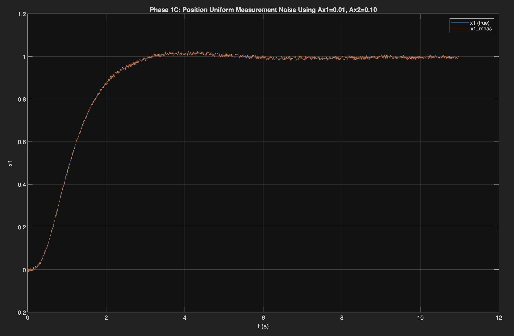

---
**Phase 1C Velocity Response Curve - Uniform Noise on Plant Output**

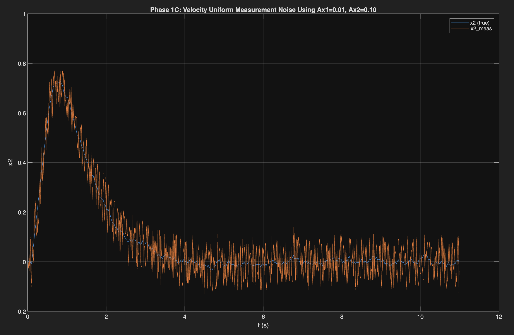

---
**Phase 1C Control Output Curves - Uniform Noise on Plant Output**

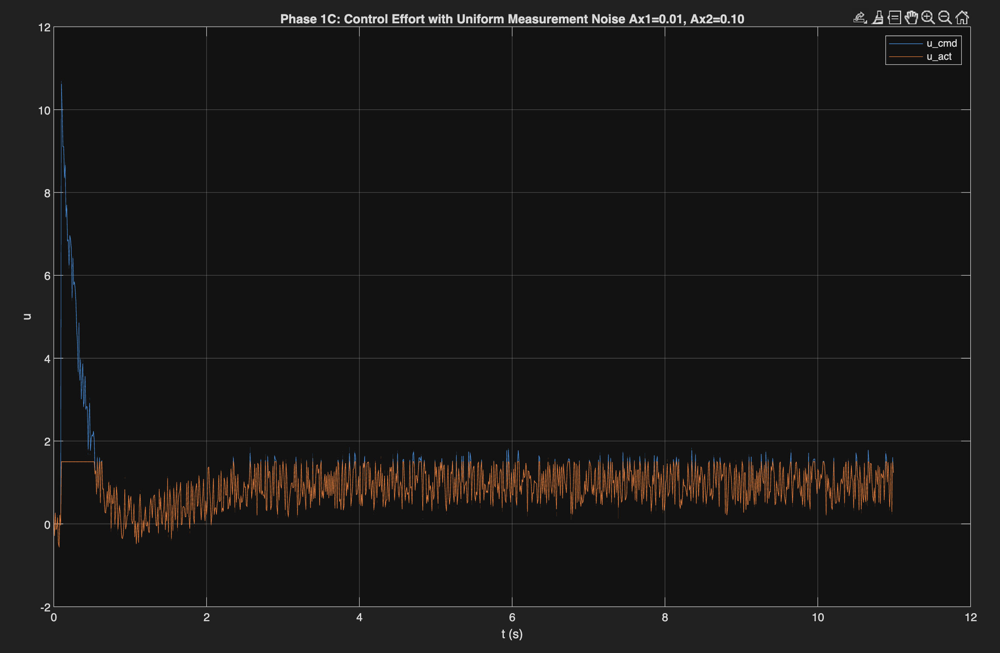

---
#### 9.5.1 Qualitative Response Characteristics

With uniform measurement noise applied, the closed-loop system remains **stable, well-damped, and predictable**.

* Position tracking remains accurate, with noise appearing as small-amplitude measurement jitter around the true trajectory.
* Velocity measurement noise is visibly amplified relative to position due to differentiation sensitivity.
* Control effort exhibits increased high-frequency activity driven by noisy velocity feedback.
* Actuator saturation is **not** persistently engaged due to noise alone.
* The response remains bounded, with fluctuations dominated by measurement noise rather than self-sustained oscillation.

The system converges cleanly to the reference position, with noise affecting actuator activity more than state accuracy.

---

#### 9.5.2 Quantitative Impact of Measurement Noise

---
| Metric         | Manual (Run 14) | Autotuned  | Phase 0 (Embedded Verification) | Phase 1A (Embedded sat = 1.5) | Phase 1C (Noise) |
| -------------- | --------------- | ---------- | ------------------------------- | ----------------------------- | ----------------------------- |
| Rise to 90%    | 1.69 s          | **1.20 s** | 1.36 s                          | **1.60 s**                    | **1.13 s**                    |
| Overshoot      | 2.89%           | **~0%**    | 2.89%                           | **1.49%**                     | **1.52%**                     |
| Settling (2%)  | 4.09 s          | **1.47 s** | 4.09 s                          | **2.57 s**                    | **1.88 s**                    |
| Control Energy (total) $\int u^2\,dt$ | 6.79            | 8.34       | 7.69                            | **6.98**                      | **11.29**                     |
| Cost J         | 9.43            | **3.60**   | -                               | -                             | -                             |
---

Apparent improvements in rise and settling time relative to Phase 1A should be interpreted cautiously. While measurement noise has zero mean and introduces no net force or momentum, it increases control-effort variance through amplification in the derivative path. This increased variability can produce small deviations about the nominal trajectory that may trigger earlier threshold crossings, without implying a genuine improvement in underlying closed-loop performance.

**Observations**
* The reduction in rise time relative to Phase 1A does not correspond to a qualitative improvement in transient response and is likely influenced by noise coupling into the derivative path.
* Overshoot remains bounded and comparable to Phase 1A, indicating no evident adverse interaction with integral action.
* The reduction in settling time follows the same trend and should be interpreted cautiously, as it may reflect noise-driven transient effects rather than improved damping.
* Control energy increases significantly (≈ +62% vs Phase 1A), consistent with measurement noise primarily increasing actuator activity rather than improving state regulation.

**Several important conclusions emerge from Phase 1C:**

1. **The controller tolerates the tested measurement noise levels without loss of closed-loop behavior.**

   The state response remains smooth and bounded, with noise effects appearing primarily in actuator activity.

2. **Derivative feedback is the dominant noise pathway.**

   Velocity noise excites the derivative term, increasing control-effort variance without destabilizing the loop.

3. **Uniform noise at the selected amplitudes produces bounded and repeatable effects.**

   The injected disturbances introduce visible measurement jitter without degrading convergence or steady-state accuracy.

4. **Additional measurement filtering is not yet justified by observed behavior.**

   For the tested noise levels and operating conditions, no instability, drift, or degradation requiring filtering was observed.

---

### 9.6 Phase 1C Conclusion - Measurement Noise Sensitivity

Phase 1C measurement noise testing is considered complete.

The locked manual controller (Run 14) demonstrates bounded and repeatable behavior under uniform measurement noise at the selected amplitudes. Noise propagates primarily into control effort rather than state accuracy, and no adverse interactions with saturation or integral action are observed.

Phase 1C measurement noise testing is complete. The locked manual controller (Run 14) exhibits bounded and repeatable behavior under uniform measurement noise at the selected amplitudes. Noise effects propagate primarily into control effort rather than state accuracy, and no adverse interaction with saturation or integral action is observed.

---

#### 9.6.1 Phase 1C - Closure

Phase 1C measurement noise testing is complete. The locked manual controller (Run 14) exhibits bounded and repeatable behavior under uniform measurement noise at the selected amplitudes. Noise effects propagate primarily into control effort rather than state accuracy, and no adverse interaction with saturation or integral action is observed.

#### 9.6.2 Phase 1C Scope / Exclusions

Backlash and deadzone modeling were considered but excluded because this project applies actuator force directly to the plant states without a drivetrain element. These effects are transmission nonlinearities and fall outside the modeling scope of this system.

---

## 10. Design Decisions & Tradeoffs

This section records deliberate design decisions made to preserve clarity, interpretability, and embedded–simulation equivalence throughout the investigation.

---

### DDR 1 - Freeze controller gains (Run 14) and prohibit Phase 1 retuning

**Decision:**

Lock the manual best controller (Run 14) and treat all subsequent phases (1A–1C) as non-ideality sensitivity evaluation rather than retuning.

**Alternatives considered:**
* Retune gains for each added non-ideality (saturation, disturbance, noise).
* Autotune again after each realism layer.

**Rationale:**

The goal of this project is embedded equivalence and realism-layer validation, not re-optimization. Retuning would destroy comparability across phases and obscure whether observed behavior changes arise from the introduced non-ideality or from gain modification.

**Consequences / tradeoffs:**
* Preserves clear, phase-to-phase comparability.
* Forces interpretability: if tracking fails, it reveals a physical limitation (e.g., actuator limits) rather than a moving target.
* Some combinations (e.g., saturation + constant disturbance + noise) can exhibit steady-state offset because the actuator cannot supply the required mean control output.

---

### DDR 2 - Saturation modeled inside the controller; disturbance modeled external to actuator limits

**Decision:**

Keep actuator saturation as part of the controller output path (consistent with actuator-effort limitation), while modeling disturbance as an external load acting on the plant.

**Alternatives considered:**
* Move saturation outside the controller (treat it as a plant input limiter).
* Lump disturbance into the controller output path.

**Rationale:**

Saturation is an actuator constraint on commanded effort; disturbance is an exogenous input to the plant. Keeping them separate preserves the physical interpretation and makes loss of steady-state tracking under actuator saturation an expected and explainable outcome rather than a modeling artifact.

**Consequences / tradeoffs:**
* Clean separation of causes: actuator authority vs external load.
* Makes the Phase 1B/1C interaction behavior physically interpretable.
* When disturbance magnitude approaches available actuator authority, perfect tracking is not achievable even with integral action.

---

### DDR 3 - Noise model: uniform, bounded, deterministic; injected on measured signals and logged alongside truth

**Decision:**

Use a minimal measurement noise model: uniform bounded noise applied additively to measured position and velocity, with deterministic generation and logging of both “true” and “measured” states.

**Alternatives considered:**
* Gaussian noise.
* Colored noise / filtered noise.
* Quantization-only noise.

**Rationale:**

Bounded uniform noise provides a simple, transparent stressor that is easy to reason about and reproduce. Determinism ensures embedded $\leftrightarrow$ Simulink comparisons remain meaningful and repeatable. Logging both true and measured states prevents ambiguity about whether observed behavior is plant motion or measurement artifact.

**Consequences / tradeoffs:**
* Reproducible runs; clear attribution of effects.
* Exposes the derivative term’s sensitivity to measurement noise while preserving a simple, interpretable noise model.
* Does not represent sensor spectral shaping or bandwidth effects, which fall outside the modeling scope of this work.

---

### DDR 4 - No measurement filtering in Phase 1C

**Decision:**

Do not add EMA/LPF filtering at this realism level.

**Alternatives considered:**
* EMA on measured velocity.
* Low-pass filter on measurement channels.

**Rationale:**

Phase 1C goal is *sensitivity characterization*, not “fixing” behavior by adding complexity. The observed response under the chosen noise amplitudes is stable and bounded; additional filtering would be premature and would complicate equivalence testing.

**Consequences / tradeoffs:**
* Keeps the noise-sensitivity evaluation minimal and interpretable.
* Avoids introducing filter phase lag and additional tuning.
* Control effort shows increased high-frequency activity due to noisy velocity feedback, which is acceptable for sensitivity characterization at this phase.

---

### DDR 5 - Canonical logging path: MATLAB UART capture to CSV; time reconstructed from sample index

**Decision:**

Use MATLAB UART capture as the canonical long-run data path; treat $k$ as authoritative and reconstruct time from $k$ and fixed $T_s$.

**Alternatives considered:**
* Terminal/screen capture.
* Trust logged time stamps as authoritative.

**Rationale:**

Embedded logging is treated as a fixed interface contract. The MATLAB capture path supports long horizons without truncation and preserves clean numeric logs. Using $k$ avoids failures caused by dropped lines and serial timing artifacts.

**Consequences / tradeoffs:**
* Reliable long-horizon verification.
* Analysis scripts become robust and repeatable.
* Requires discipline: no non-numeric prints inside the CSV stream. Non-numeric prints inside the CSV stream corrupt the data format, breaking column alignment and preventing reliable parsing and post-processing.

---

## 11.0 Knowledge Preservation

**Discrete-time simulation and embedded execution can differ in rise time even when the controller is identical.**

Differences in when control outputs take effect within a sampling interval can produce consistent rise-time discrepancies between Simulink and firmware without indicating an error in controller structure, ordering, or logic. In firmware, control outputs take effect immediately after computation, whereas the Simulink model applies updates through a scheduled signal-flow structure that delays output application until the entire block diagram has been resolved. Remembering this distinction helps avoid chasing non-existent implementation bugs.

---

**Integral action cannot guarantee steady-state tracking under actuator saturation.**

Integral action can eliminate constant disturbances only if the actuator can supply the required steady-state force. When saturation is active and the disturbance consumes most of the available actuator output, steady-state tracking can be lost. This is not a controller flaw - it is a physical limitation imposed by actuator authority.

---

**Reduced actuator limits can shorten settling time by limiting transient energy injection.**

In Phase 1A, reduced saturation limits produced a shorter settling tail despite a modest increase in rise time. Constraining peak control force limited early kinetic energy buildup, reducing the amount of energy that had to be dissipated before the response remained within tolerance. Higher actuator limits allow faster motion, but faster settling requires sufficient damping to dissipate the additional stored energy.

---

**Derivative action is the dominant noise pathway in this architecture.**

Noise on velocity feedback couples directly into the control effort. The practical symptom is increased high-frequency activity in (u_{\text{cmd}}), even when position remains smooth and bounded.

---

**Logging is an API, not ad-hoc debug output.**

The logging format (stable columns, numeric-only rows, and (k) as the time base) functions as an interface contract. Breaking this contract creates analysis churn and forces time-consuming cleanup that adds no engineering value.

---

**Introducing non-idealities incrementally preserves causal attribution.**

Introducing multiple realism layers simultaneously makes it difficult or impossible to determine which effect caused a given behavior. Adding them one at a time preserved interpretability throughout the investigation.

---

**Model placement matters as much as model choice.**

Saturation belongs in the actuator-effort path; disturbances belong as exogenous plant inputs; measurement noise belongs on measured signals. Misplacement creates misleading dynamics and “mystery behavior” that wastes time.

---
